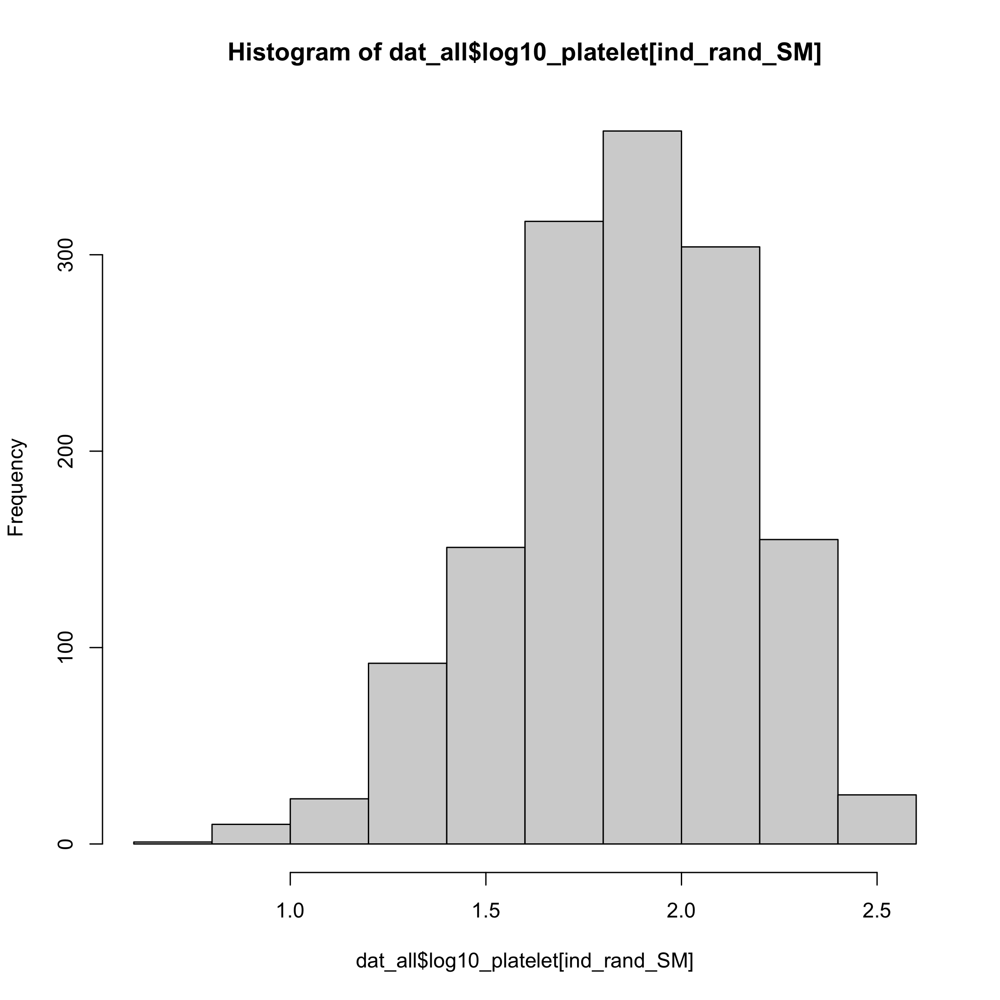
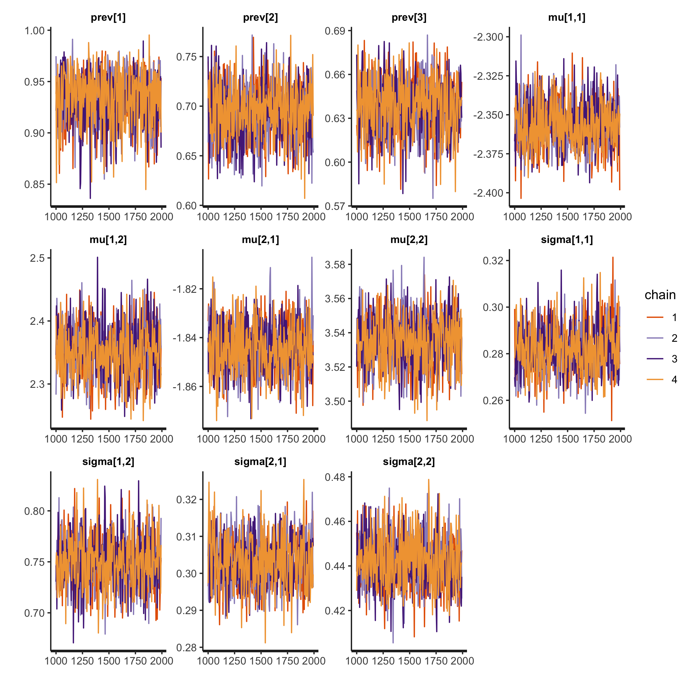
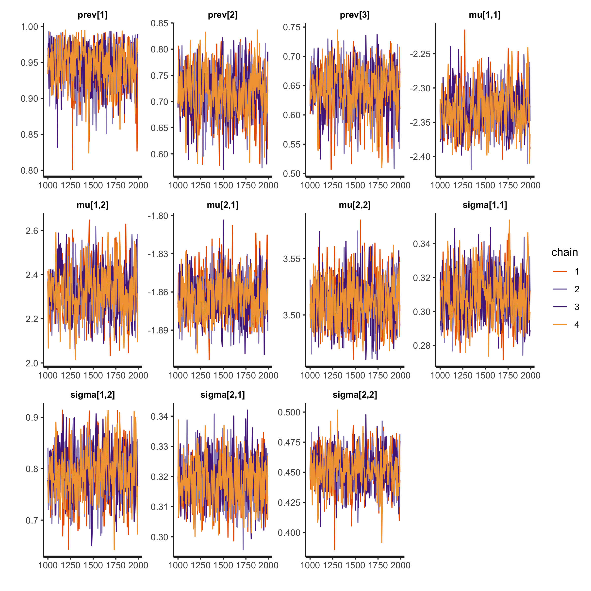
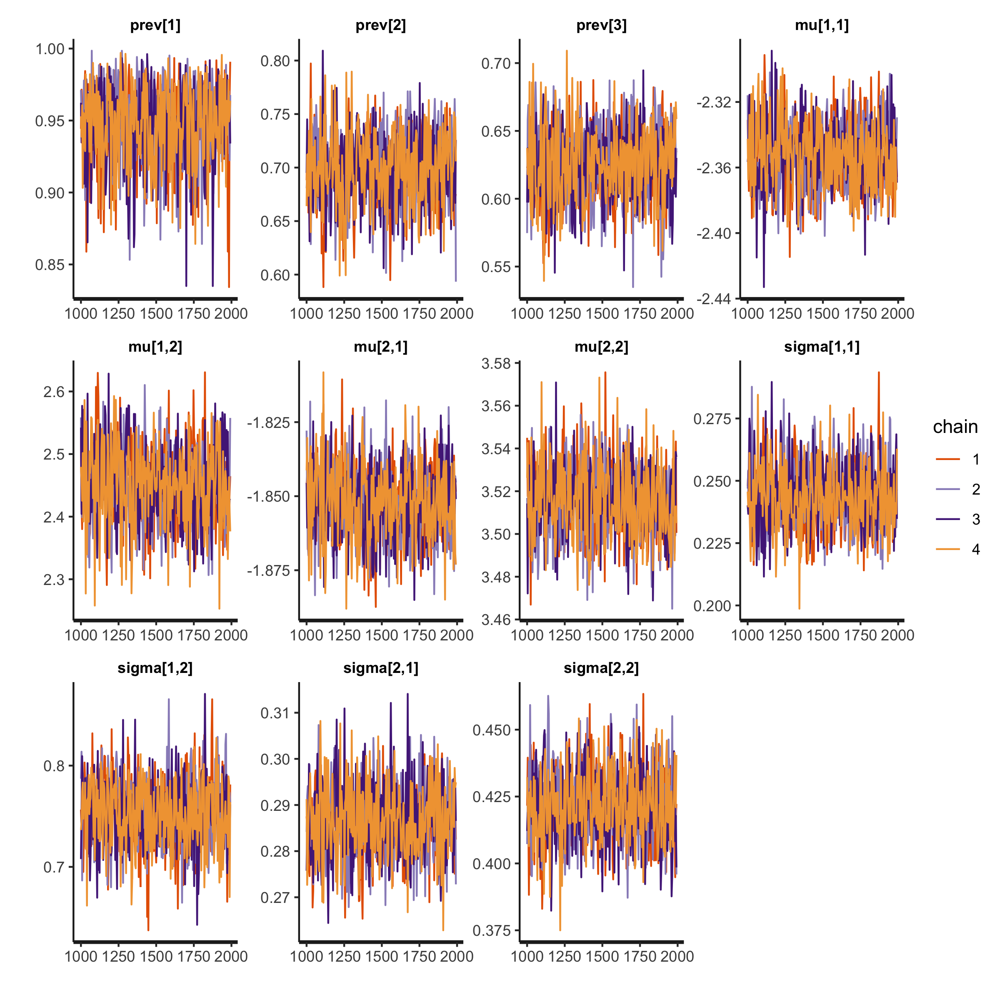
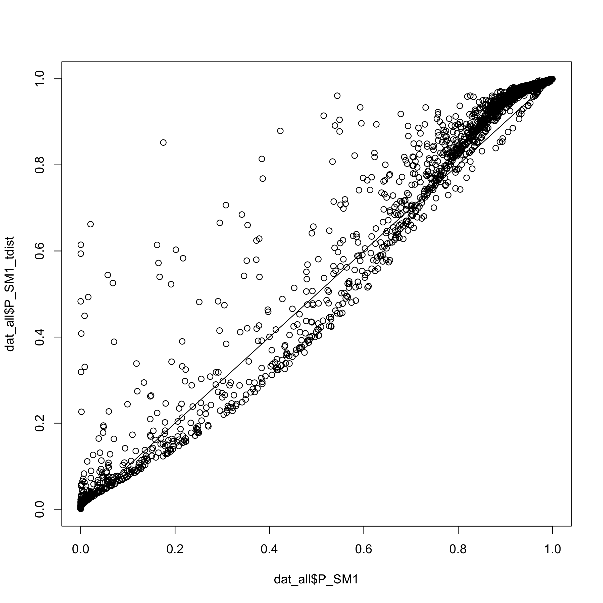
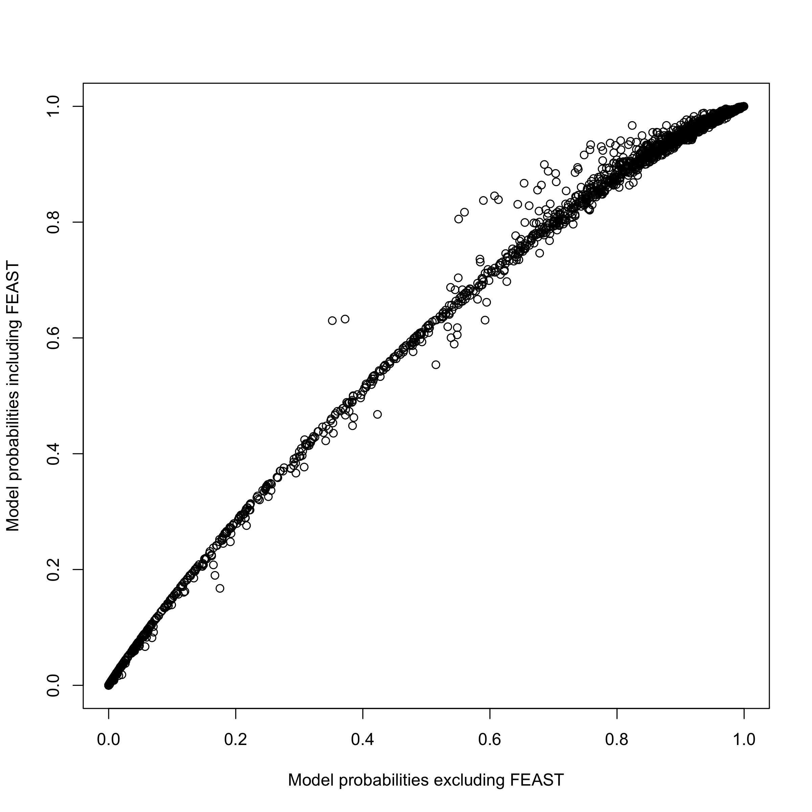
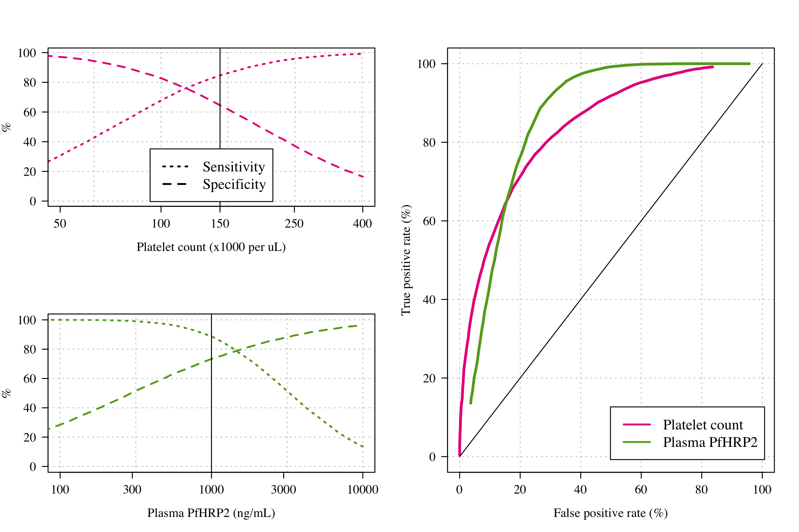
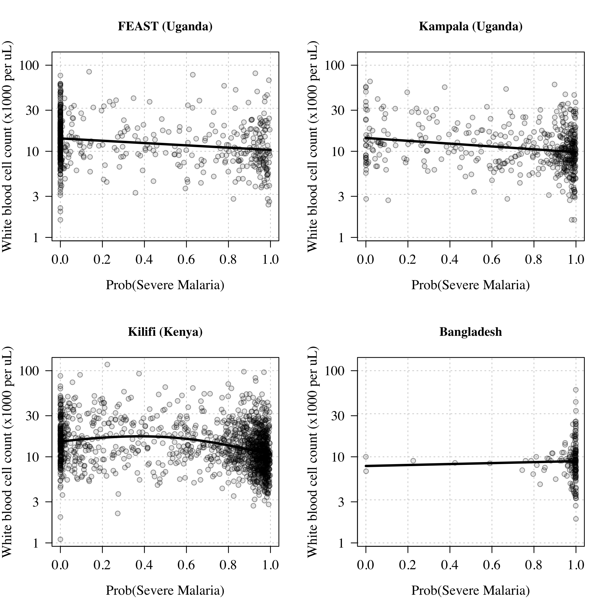
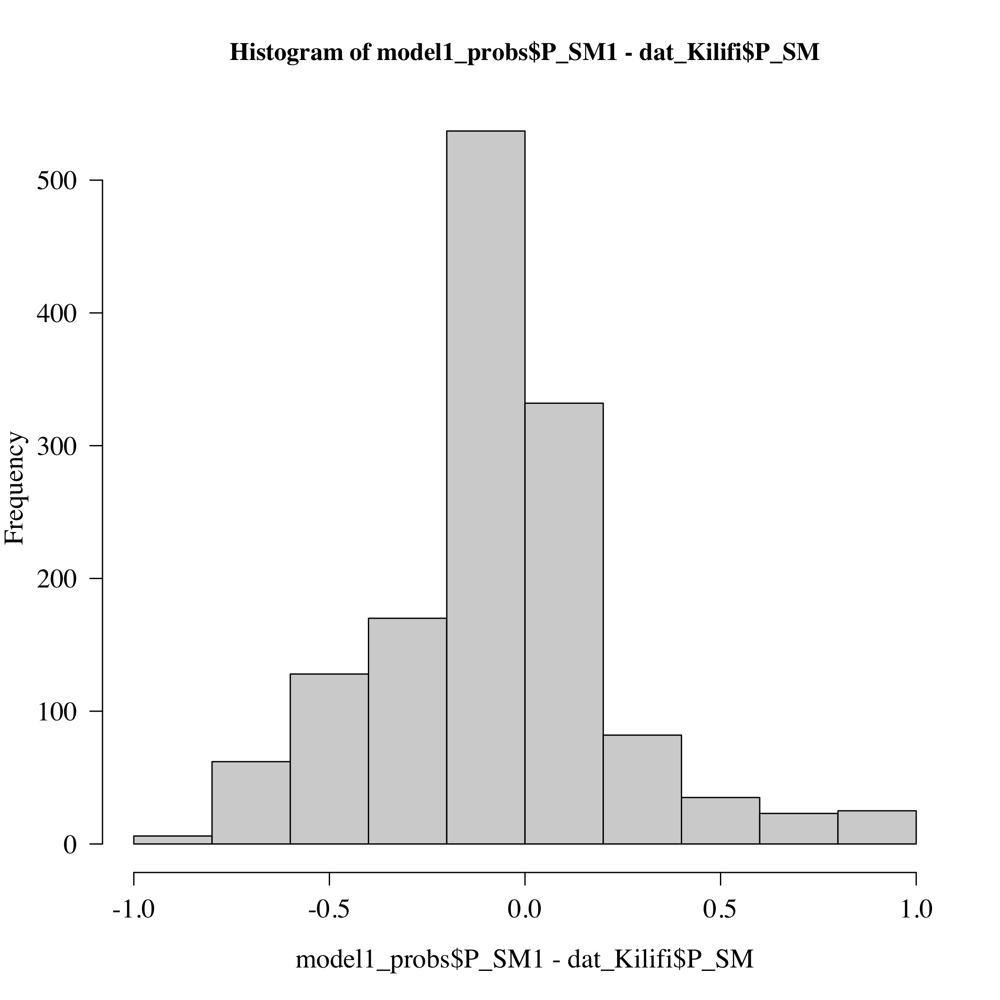

```
## Loading required package: nlme
```

```
## This is mgcv 1.8-31. For overview type 'help("mgcv-package")'.
```

```
## Loading required package: Matrix
```

```
## 
## Attaching package: 'lme4'
```

```
## The following object is masked from 'package:nlme':
## 
##     lmList
```

```
## Package 'mclust' version 5.4.6
## Type 'citation("mclust")' for citing this R package in publications.
```

```
## 
## Attaching package: 'mclust'
```

```
## The following object is masked from 'package:mgcv':
## 
##     mvn
```

```
## Loading required package: StanHeaders
```

```
## Loading required package: ggplot2
```

```
## rstan (Version 2.21.2, GitRev: 2e1f913d3ca3)
```

```
## For execution on a local, multicore CPU with excess RAM we recommend calling
## options(mc.cores = parallel::detectCores()).
## To avoid recompilation of unchanged Stan programs, we recommend calling
## rstan_options(auto_write = TRUE)
```

```
## 
## Attaching package: 'gtools'
```

```
## The following object is masked from 'package:mgcv':
## 
##     scat
```

```
## 
## Attaching package: 'dplyr'
```

```
## The following object is masked from 'package:nlme':
## 
##     collapse
```

```
## The following objects are masked from 'package:stats':
## 
##     filter, lag
```

```
## The following objects are masked from 'package:base':
## 
##     intersect, setdiff, setequal, union
```

```
## 
## Attaching package: 'mvtnorm'
```

```
## The following object is masked from 'package:mclust':
## 
##     dmvnorm
```

```
## 
## Attaching package: 'LaplacesDemon'
```

```
## The following objects are masked from 'package:mvtnorm':
## 
##     dmvt, rmvt
```

```
## The following objects are masked from 'package:gtools':
## 
##     ddirichlet, logit, rdirichlet
```

```
## The following object is masked from 'package:mgcv':
## 
##     rmvn
```

```
## R version 4.0.2 (2020-06-22)
## Platform: x86_64-apple-darwin17.0 (64-bit)
## Running under: macOS  10.16
## 
## Matrix products: default
## BLAS:   /Library/Frameworks/R.framework/Versions/4.0/Resources/lib/libRblas.dylib
## LAPACK: /Library/Frameworks/R.framework/Versions/4.0/Resources/lib/libRlapack.dylib
## 
## locale:
## [1] en_US.UTF-8/en_US.UTF-8/en_US.UTF-8/C/en_US.UTF-8/en_US.UTF-8
## 
## attached base packages:
## [1] stats     graphics  grDevices utils     datasets  methods   base     
## 
## other attached packages:
##  [1] LaplacesDemon_16.1.6 mvtnorm_1.1-1        reshape2_1.4.4      
##  [4] dplyr_1.0.0          gtools_3.8.2         rstan_2.21.2        
##  [7] ggplot2_3.3.2        StanHeaders_2.21.0-5 mclust_5.4.6        
## [10] lme4_1.1-23          Matrix_1.2-18        mgcv_1.8-31         
## [13] nlme_3.1-148         RColorBrewer_1.1-2  
## 
## loaded via a namespace (and not attached):
##  [1] Rcpp_1.0.5.1       lattice_0.20-41    prettyunits_1.1.1  ps_1.3.3          
##  [5] assertthat_0.2.1   digest_0.6.25      V8_3.2.0           R6_2.4.1          
##  [9] plyr_1.8.6         stats4_4.0.2       evaluate_0.14      pillar_1.4.6      
## [13] rlang_0.4.7        curl_4.3           minqa_1.2.4        callr_3.4.3       
## [17] nloptr_1.2.2.2     rmarkdown_2.3      splines_4.0.2      statmod_1.4.34    
## [21] stringr_1.4.0      loo_2.3.1          munsell_0.5.0      compiler_4.0.2    
## [25] xfun_0.15          pkgconfig_2.0.3    pkgbuild_1.1.0     htmltools_0.5.0   
## [29] tidyselect_1.1.0   tibble_3.0.3       gridExtra_2.3      codetools_0.2-16  
## [33] matrixStats_0.56.0 fansi_0.4.1        crayon_1.3.4       withr_2.2.0       
## [37] MASS_7.3-51.6      grid_4.0.2         jsonlite_1.7.0     gtable_0.3.0      
## [41] lifecycle_0.2.0    magrittr_1.5       scales_1.1.1       RcppParallel_5.0.2
## [45] cli_2.0.2          stringi_1.4.6      ellipsis_0.3.1     generics_0.0.2    
## [49] vctrs_0.3.2        boot_1.3-25        tools_4.0.2        glue_1.4.1        
## [53] purrr_0.3.4        processx_3.4.3     parallel_4.0.2     yaml_2.2.1        
## [57] inline_0.3.15      colorspace_1.4-1   knitr_1.29
```


# Load dataset 

## Check outliers


```
## The dataset contains 2649 patients with measured PfHRP2 and measured platelet counts from 4 studies
```

```
## Patients per study:
```

```
## 
##       Bangladesh   FEAST (Uganda) Kampala (Uganda)   Kilifi (Kenya) 
##              172              567              492             1418
```


## Some data cleaning

<!-- -->

```
## 
## FALSE  TRUE 
##     6  2643
```

```
## 
##     Bangladesh FEAST (Uganda) Kilifi (Kenya) 
##              1              8             18
```

<!-- -->

```
## A total of 27 samples have zero PfHRP2 but more than 1000 parasites per uL
```

```
## After excluding the HRP2 outliers, the dataset contains 2622 patients with measured PfHRP2 and measured platelet counts
```

## Overview of patient characteristics

Results for Table 1 in the paper

```
## 
##       Bangladesh   FEAST (Uganda) Kampala (Uganda)   Kilifi (Kenya) 
##              171              559              492             1400
```

```
##    
##     Bangladesh FEAST (Uganda) Kampala (Uganda) Kilifi (Kenya)
##   0          0            227                0              0
##   1        171            332              492           1400
```

```
##              study age.lower age.median age.upper
## 1       Bangladesh      23.5       30.0      45.0
## 2   FEAST (Uganda)       1.2        2.0       3.3
## 3 Kampala (Uganda)       2.2        3.3       4.6
## 4   Kilifi (Kenya)       1.4        2.4       3.7
```

```
##              study hrp2
## 1       Bangladesh  171
## 2   FEAST (Uganda)  559
## 3 Kampala (Uganda)  492
## 4   Kilifi (Kenya) 1400
```

```
##              study outcome
## 1       Bangladesh    26.9
## 2   FEAST (Uganda)    11.4
## 3 Kampala (Uganda)     6.7
## 4   Kilifi (Kenya)    11.1
```

```
##              study platelet.25% platelet.50% platelet.75%
## 1       Bangladesh         27.0         50.0        139.0
## 2   FEAST (Uganda)         74.5        165.0        326.0
## 3 Kampala (Uganda)         49.0         96.0        169.5
## 4   Kilifi (Kenya)         64.0        111.0        215.0
```

```
##              study  hrp2.25%  hrp2.50%  hrp2.75%
## 1       Bangladesh 1082.9050 2667.0400 6127.5550
## 2   FEAST (Uganda)    0.0000  174.7100 1952.6900
## 3 Kampala (Uganda)  588.0000 1838.4000 4097.4000
## 4   Kilifi (Kenya)  418.7393 2206.7408 5071.5299
```

```
##              study wbc.25% wbc.50% wbc.75%
## 1       Bangladesh   6.900   9.000  11.000
## 2   FEAST (Uganda)   8.400  11.950  18.675
## 3 Kampala (Uganda)   7.500  10.400  15.300
## 4   Kilifi (Kenya)   8.900  12.550  19.000
```

```
##              study para.25% para.50% para.75%
## 1       Bangladesh    23550   148874   348540
## 2   FEAST (Uganda)     3640    37600   153680
## 3 Kampala (Uganda)    10635    42530   198540
## 4   Kilifi (Kenya)     6099    69824   316350
```

```
##                   
##                       1    2    3
##   Bangladesh          0    0    0
##   FEAST (Uganda)    466   46   21
##   Kampala (Uganda)  463    4   23
##   Kilifi (Kenya)   1348   41    7
```


Correlation between the platelet count and the PfHRP2 concentration


```
## African sites: correlation:
```

```
## 
## 	Pearson's product-moment correlation
## 
## data:  log10(dat_all$platelet[ind_Africa]) and log10(dat_all$hrp2 + 1)[ind_Africa]
## t = -31.892, df = 2449, p-value < 2.2e-16
## alternative hypothesis: true correlation is not equal to 0
## 95 percent confidence interval:
##  -0.5690929 -0.5131183
## sample estimates:
##        cor 
## -0.5417058
```

```
## [1] -186.2477
```

```
##   cor 
## -0.54
```

```
## Bangladesh: correlation:
```

```
## 
## 	Pearson's product-moment correlation
## 
## data:  log10(dat_all$platelet[!ind_Africa]) and log10(dat_all$hrp2 + 1)[!ind_Africa]
## t = -4.9404, df = 169, p-value = 1.863e-06
## alternative hypothesis: true correlation is not equal to 0
## 95 percent confidence interval:
##  -0.4797402 -0.2167256
## sample estimates:
##        cor 
## -0.3552439
```

```
## [1] -5.72988
```

```
##   cor 
## -0.36
```

Summary plot of the biomarker data

<!-- -->


# Basic data exploration: clustering with mclust

mclust is a generic Bayesian clustering algorithm (fits multivariate normals to the data)

We merge all the data into one and fit mclust


```
## [1] 2477
```

```
## 
##       Bangladesh   FEAST (Uganda) Kampala (Uganda)   Kilifi (Kenya) 
##              170              425              484             1398
```

```
## ---------------------------------------------------- 
## Gaussian finite mixture model fitted by EM algorithm 
## ---------------------------------------------------- 
## 
## Mclust VEV (ellipsoidal, equal shape) model with 4 components: 
## 
##  log-likelihood    n df       BIC       ICL
##       -6671.425 2477 33 -13600.74 -14640.71
## 
## Clustering table:
##    1    2    3    4 
## 1038  140  837  462
```

```
## ---------------------------------------------------- 
## Gaussian finite mixture model fitted by EM algorithm 
## ---------------------------------------------------- 
## 
## Mclust VVE (ellipsoidal, equal orientation) model with 4 components: 
## 
##  log-likelihood    n df       BIC       ICL
##       -3708.804 2477 20 -7573.904 -8377.639
## 
## Clustering table:
##    1    2    3    4 
##   66  144 1486  781
```

<!-- -->

```
## ---------------------------------------------------- 
## Gaussian finite mixture model fitted by EM algorithm 
## ---------------------------------------------------- 
## 
## Mclust VEV (ellipsoidal, equal shape) model with 4 components: 
## 
##  log-likelihood    n df       BIC       ICL
##       -5850.394 2477 20 -11857.08 -12957.88
## 
## Clustering table:
##   1   2   3   4 
## 589 853 891 144
```

<!-- -->

```
## ---------------------------------------------------- 
## Gaussian finite mixture model fitted by EM algorithm 
## ---------------------------------------------------- 
## 
## Mclust VVE (ellipsoidal, equal orientation) model with 3 components: 
## 
##  log-likelihood    n df       BIC       ICL
##        -4172.28 2477 15 -8461.781 -9076.909
## 
## Clustering table:
##    1    2    3 
## 1319  196  962
```

<!-- -->

```
##                   
##                      1   2   3   4
##   Bangladesh         3   0 139  28
##   FEAST (Uganda)    28 141 139 117
##   Kampala (Uganda)   8   0 321 155
##   Kilifi (Kenya)    27   3 887 481
```


In conclusion, the distribution of the parasite count is less easily decomposed than that of the platelet count or HRP2 concentration. The HRP2 and platelet count is the only one where the estimated break is not othorgonal to either variable.

# Fitting a mixture model to platelets and HRP2
## Two component mixture - not including FEAST

### Main model

Analysis not including the FEAST study - only severe malaria studies

We convert the platelet counts and HRP2 measurements to log10 scale. The Platelet counts then get multiplied by minus 1: this is so that increasing values correspond to more likely severe malaria. This is because the underlying stan model uses the *ordered* vector type to avoid label switching problems. 


```
## site_index_SMstudies
##    1    2    3 
##  171  492 1400
```

```
## [1] 2063
```

```
## Priors on mean biomarker values:
```

```
##          [,1]      [,2]
## [1,] -2.39794 -1.875061
## [2,]  2.30103  3.477121
```

```
## Priors on standard deviations around biomarker values:
```

```
##      [,1] [,2]
## [1,]  0.1  0.1
## [2,]  0.1  0.1
```

```
## Priors on prevalence of SM:
```

```
##      [,1] [,2]
## [1,]   19    1
## [2,]   14    6
## [3,]   14    6
```


compile the stan model


Run the stan models - outputs are stored in Rout


We check convergence with the traceplots

<!-- --><!-- --><!-- --><!-- -->

```
## prevalence estimates for the three studies: model without correlation:
```

```
## [1] 94 71 65
```

```
## prevalence estimates for the three studies: model with correlation:
```

```
## [1] 96 73 66
```

```
## prevalence estimates for the three studies: model with correlation and weak priors:
```

```
## [1] 95 73 65
```

```
## prevalence estimates for the three studies: model with correlation and t-distributions:
```

```
## [1] 96 74 67
```

```
## mean values estimates for the 4 models:
```

```
## thetas_all
##                 
##                  not SM   SM
##   Platelet count    232   71
##   PfHRP2            193 3392
## thetas_all_cor
##                 
##                  not SM   SM
##   Platelet count    222   74
##   PfHRP2            189 3205
## thetas_all_cor_WP
##                 
##                  not SM   SM
##   Platelet count    218   74
##   PfHRP2            197 3230
## thetas_all_cor_tdist
##                 
##                  not SM   SM
##   Platelet count    242   74
##   PfHRP2            204 3202
```

```
## Standard deviation estimates for the 4 models:
```

```
##       
##             [,1]      [,2]
##   [1,] 0.2811903 0.7333359
##   [2,] 0.3053538 0.4456030
```

```
##       
##             [,1]      [,2]
##   [1,] 0.3056151 0.7690742
##   [2,] 0.3189634 0.4559764
```

```
##       
##             [,1]      [,2]
##   [1,] 0.3070648 0.7758202
##   [2,] 0.3186704 0.4529417
```

```
##       
##             [,1]      [,2]
##   [1,] 0.2346785 0.7134718
##   [2,] 0.2905635 0.4305740
```

```
## Correlation in Severe Malaria:
```

```
## [1] 0.1761821
```

```
## Correlation in not Severe Malaria:
```

```
## [1] 0.2406991
```

<!-- -->

```
## [1] 1304
```

```
## [1] 403
```


Classifications under the bivariate normal model

<!-- -->


Classifications under the bivariate t-distribution model

<!-- -->


### Platelet counts in not Severe Malaria

<!-- --><!-- --><!-- --><!-- -->


### Sensitivity analysis - only African studies

Just use the two severe malaria studies from Africa

```
## site_index_SMAfrica
##    1    2 
##  492 1400
```

Run model and check convergence

```
## 'pars' not specified. Showing first 10 parameters by default.
```

<!-- -->

```
## [1] 71 65
```

```
## Mean estimated values across the groups:
```

```
##                 
##                  not SM   SM
##   Platelet count    219   77
##   PfHRP2            197 3385
```


### ROC curves for main model fit


<!-- -->

```
## Platelet cutoff of 150,000 per uL has a sensitivity of 83% and a specificity of 71%
```

```
## PLasma PfHRP2 cutoff of 1000 ng/ml has a sensitivity of 87% and a specificity of 83%
```


Empirical ROC curves derived from patient probabilties
<!-- -->

## Three component mixture - including FEAST


This does not fit when we add parasite counts. So we are only using two biomarkers


```
## site_index_all_studies
##    1    2    3    4 
##  171  559  492 1400
```

```
## Priors on mean biomarker values:
```

```
##           [,1]     [,2]      [,3]
## [1,] -2.477121 -2.39794 -1.875061
## [2,]  0.000000  2.30103  3.477121
```

```
## Priors on standard deviations around biomarker values:
```

```
##      [,1] [,2] [,3]
## [1,]  0.1  0.1  0.1
## [2,]  0.1  0.1  0.1
```

```
## Priors on prevalence of SM:
```

```
##      [,1] [,2] [,3]
## [1,]  0.1    1   19
## [2,]  1.0    6   14
## [3,]  1.0    6   14
## [4,]  3.0    3    3
```

Run models:


<!-- -->

```
## Estimated prevalences across the 4 studies:
```

```
##        
##         Bangladesh FEAST (Uganda) Kampala (Uganda) Kilifi (Kenya)
##   2.5%        91.0           31.4             66.6           61.0
##   50%         96.1           36.6             73.5           65.9
##   97.5%       98.8           41.9             79.4           70.2
```

```
##                 
##                  not SM not SM   SM
##   Platelet count    289    208   74
##   PfHRP2              1    179 3135
```

```
## In SM the 95% pred interval for the platelet count is 17 to 312 with a mean of 74
```

```
## In SM the 95% pred interval for the PfHRP2 concentration is 402 to 24452 with a mean of 3135
```

```
## In not SM the 95% pred interval for the platelet count is 51 to 844 with a mean of 208
```

```
## In not SM the 95% pred interval for the PfHRP2 concentration is 5 to 6376 with a mean of 179
```


Make a P(SM) variable for subsequent analysis (continuous) and a discrete classification based on a cutoff of 0.5
<!-- --><!-- -->


# Downstream analyses

## Severe malaria probability and subphenotypes

Relationship with the two main subphenotypes, cerebral malaria and severe malaria anaemia

```
## False diagnosis rate by coma status and by study:
```

```
##   coma            study        SM
## 1    0       Bangladesh 0.9841270
## 2    1       Bangladesh 0.9722222
## 3    0   FEAST (Uganda) 0.3423423
## 4    1   FEAST (Uganda) 0.4495413
## 5    0 Kampala (Uganda) 0.6578947
## 6    1 Kampala (Uganda) 0.8863636
## 7    0   Kilifi (Kenya) 0.7422680
## 8    1   Kilifi (Kenya) 0.6616162
```

```
## True diagnosis rate by severe anaemia status (<15% haematocrit) and by study:
```

```
##   SMA            study        SM
## 1   0       Bangladesh 0.9753086
## 2   1       Bangladesh 1.0000000
## 3   0   FEAST (Uganda) 0.3454106
## 4   1   FEAST (Uganda) 0.4265734
## 5   0 Kampala (Uganda) 0.8686441
## 6   1 Kampala (Uganda) 0.6992188
## 7   0   Kilifi (Kenya) 0.6567835
## 8   1   Kilifi (Kenya) 0.8666667
```


Main model fits - three component model

```
## , , study = Bangladesh
## 
##       class
## sickle   0   1
##      1   0   0
##      2   0   0
##      3   0   0
## 
## , , study = FEAST (Uganda)
## 
##       class
## sickle   0   1
##      1 279 187
##      2  40   6
##      3  20   1
## 
## , , study = Kampala (Uganda)
## 
##       class
## sickle   0   1
##      1  90 373
##      2   1   3
##      3  17   6
## 
## , , study = Kilifi (Kenya)
## 
##       class
## sickle   0   1
##      1 386 962
##      2  26  15
##      3   6   1
```

<!-- -->

## Parasite densities


```
## [1] "FEAST (Uganda)"
##        1 
## 16.00333
```

```
## [1] "Kampala (Uganda)"
##        1 
## 11.72597
```

```
## [1] "Kilifi (Kenya)"
##        1 
## 13.79889
```

<!-- -->

```
## [1] "Bangladesh"
##         1 
## 0.4098848
```

```
##                          Estimate Std. Error    t value      Pr(>|t|)
## (Intercept)            3.80711388 0.09259111 41.1174875 2.295592e-277
## P_SM                   1.10564132 0.05645907 19.5830606  4.345939e-79
## studyFEAST (Uganda)   -0.23100536 0.09978384 -2.3150578  2.069762e-02
## studyKampala (Uganda) -0.09881157 0.08798038 -1.1231092  2.615086e-01
## studyKilifi (Kenya)    0.06215478 0.08114712  0.7659517  4.437838e-01
```

```
## The expected fold increase in parasite density between true severe malaria (P_SM=1) and not severe malaria (P_SM=0) is:
```

```
## [1]  9.9 12.8 16.5
```


## Admission haematocrits


<!-- -->

```
##   SM            study   hct
## 1  0       Bangladesh 35.00
## 2  1       Bangladesh 27.35
## 3  0   FEAST (Uganda) 30.00
## 4  1   FEAST (Uganda) 19.35
## 5  0 Kampala (Uganda) 11.75
## 6  1 Kampala (Uganda) 15.50
## 7  0   Kilifi (Kenya) 28.10
## 8  1   Kilifi (Kenya) 19.60
```

```
##   SM            study  hct
## 1  0       Bangladesh  0.0
## 2  1       Bangladesh  4.2
## 3  0   FEAST (Uganda) 21.8
## 4  1   FEAST (Uganda) 27.5
## 5  0 Kampala (Uganda) 71.3
## 6  1 Kampala (Uganda) 46.6
## 7  0   Kilifi (Kenya)  9.0
## 8  1   Kilifi (Kenya) 24.3
```

```
## [1] 19
```

```
## [1] 31
```

```
## [1] 16.4
```

```
## [1] 11.6
```

```
## [1] 19.3
```

<!-- -->

```
## [1] 28.7
```


## Mortality


P(Severe malaria) and mortality

```
## 
## Call:
## glm(formula = outcome ~ P_SM, family = "binomial", data = dat_all[ind, 
##     ])
## 
## Deviance Residuals: 
##     Min       1Q   Median       3Q      Max  
## -0.5077  -0.5077  -0.4956  -0.4684   2.1319  
## 
## Coefficients:
##             Estimate Std. Error z value Pr(>|z|)    
## (Intercept)  -1.9836     0.1713 -11.579   <2e-16 ***
## P_SM         -0.1807     0.3258  -0.555    0.579    
## ---
## Signif. codes:  0 '***' 0.001 '**' 0.01 '*' 0.05 '.' 0.1 ' ' 1
## 
## (Dispersion parameter for binomial family taken to be 1)
## 
##     Null deviance: 397.79  on 558  degrees of freedom
## Residual deviance: 397.47  on 557  degrees of freedom
## AIC: 401.47
## 
## Number of Fisher Scoring iterations: 4
```

```
## 
## Call:
## glm(formula = outcome ~ P_SM, family = "binomial", data = dat_all[ind, 
##     ])
## 
## Deviance Residuals: 
##     Min       1Q   Median       3Q      Max  
## -0.4628  -0.4492  -0.4034  -0.1959   3.1123  
## 
## Coefficients:
##             Estimate Std. Error z value Pr(>|z|)    
## (Intercept)  -4.9285     0.9532  -5.170 2.34e-07 ***
## P_SM          2.7503     1.0395   2.646  0.00815 ** 
## ---
## Signif. codes:  0 '***' 0.001 '**' 0.01 '*' 0.05 '.' 0.1 ' ' 1
## 
## (Dispersion parameter for binomial family taken to be 1)
## 
##     Null deviance: 242.07  on 491  degrees of freedom
## Residual deviance: 230.16  on 490  degrees of freedom
## AIC: 234.16
## 
## Number of Fisher Scoring iterations: 7
```

```
## 
## Call:
## glm(formula = outcome ~ P_SM, family = "binomial", data = dat_all[ind, 
##     ])
## 
## Deviance Residuals: 
##     Min       1Q   Median       3Q      Max  
## -0.5629  -0.5069  -0.4517  -0.4455   2.1765  
## 
## Coefficients:
##             Estimate Std. Error z value Pr(>|z|)    
## (Intercept)  -1.7622     0.1531 -11.509   <2e-16 ***
## P_SM         -0.5089     0.2115  -2.406   0.0161 *  
## ---
## Signif. codes:  0 '***' 0.001 '**' 0.01 '*' 0.05 '.' 0.1 ' ' 1
## 
## (Dispersion parameter for binomial family taken to be 1)
## 
##     Null deviance: 974.42  on 1399  degrees of freedom
## Residual deviance: 968.78  on 1398  degrees of freedom
## AIC: 972.78
## 
## Number of Fisher Scoring iterations: 4
```

```
## 
## Call:
## glm(formula = outcome ~ P_SM, family = "binomial", data = dat_all[ind, 
##     ])
## 
## Deviance Residuals: 
##     Min       1Q   Median       3Q      Max  
## -0.8194  -0.8183  -0.8065   1.5842   1.7703  
## 
## Coefficients:
##             Estimate Std. Error z value Pr(>|z|)
## (Intercept)   -3.460      2.362  -1.465    0.143
## P_SM           2.541      2.414   1.053    0.293
## 
## (Dispersion parameter for binomial family taken to be 1)
## 
##     Null deviance: 199.14  on 170  degrees of freedom
## Residual deviance: 197.32  on 169  degrees of freedom
## AIC: 201.32
## 
## Number of Fisher Scoring iterations: 5
```

<!-- -->


Summary of lab values by inferred subgroup

```
##   SM            study  age
## 1  0       Bangladesh 38.0
## 2  1       Bangladesh 30.0
## 3  0   FEAST (Uganda)  1.8
## 4  1   FEAST (Uganda)  2.4
## 5  0 Kampala (Uganda)  3.5
## 6  1 Kampala (Uganda)  3.2
## 7  0   Kilifi (Kenya)  2.3
## 8  1   Kilifi (Kenya)  2.4
```

```
##   SM            study log10_parasites
## 1  0       Bangladesh          100000
## 2  1       Bangladesh           79433
## 3  0   FEAST (Uganda)             251
## 4  1   FEAST (Uganda)           39811
## 5  0 Kampala (Uganda)           10000
## 6  1 Kampala (Uganda)           50119
## 7  0   Kilifi (Kenya)           10000
## 8  1   Kilifi (Kenya)           79433
```

```
##   SM            study log10_wbc
## 1  0       Bangladesh         8
## 2  1       Bangladesh         8
## 3  0   FEAST (Uganda)        13
## 4  1   FEAST (Uganda)        10
## 5  0 Kampala (Uganda)        13
## 6  1 Kampala (Uganda)        10
## 7  0   Kilifi (Kenya)        16
## 8  1   Kilifi (Kenya)        13
```

```
##   SM            study sickle.1 sickle.2 sickle.3
## 1  0   FEAST (Uganda)      279       40       20
## 2  1   FEAST (Uganda)      187        6        1
## 3  0 Kampala (Uganda)       90        1       17
## 4  1 Kampala (Uganda)      373        3        6
## 5  0   Kilifi (Kenya)      386       26        6
## 6  1   Kilifi (Kenya)      962       15        1
```

```
##   SM            study outcome
## 1  0       Bangladesh     0.0
## 2  1       Bangladesh    27.5
## 3  0   FEAST (Uganda)    12.1
## 4  1   FEAST (Uganda)    10.3
## 5  0 Kampala (Uganda)     2.8
## 6  1 Kampala (Uganda)     7.8
## 7  0   Kilifi (Kenya)    14.5
## 8  1   Kilifi (Kenya)     9.6
```

## Total white blood cell counts


<!-- -->

```
##                           Estimate  Std. Error    t value      Pr(>|t|)
## (Intercept)            1.285761892 0.045950004  27.981758 6.186292e-151
## studyFEAST (Uganda)   -0.124187000 0.043797303  -2.835494  4.610666e-03
## studyKampala (Uganda) -0.136828811 0.042309054  -3.234031  1.235762e-03
## studyKilifi (Kenya)   -0.068274021 0.042223229  -1.616978  1.060037e-01
## SM                    -0.113334922 0.011288100 -10.040213  2.666745e-23
## age                   -0.006786252 0.001189921  -5.703113  1.308529e-08
```

```
## [1] 1.29818
```

```
## WBC > 15,000 for SM versus not SM:
```

```
## 
## Family: binomial 
## Link function: logit 
## 
## Formula:
## as.numeric(wbc > 15) ~ study + SM + s(age, k = 3)
## 
## Parametric coefficients:
##                       Estimate Std. Error z value Pr(>|z|)    
## (Intercept)            1.99471    0.46831   4.259 2.05e-05 ***
## studyFEAST (Uganda)   -2.73510    0.51201  -5.342 9.20e-08 ***
## studyKampala (Uganda) -2.69471    0.48936  -5.507 3.66e-08 ***
## studyKilifi (Kenya)   -2.34451    0.49693  -4.718 2.38e-06 ***
## SM                    -0.68358    0.09872  -6.924 4.38e-12 ***
## ---
## Signif. codes:  0 '***' 0.001 '**' 0.01 '*' 0.05 '.' 0.1 ' ' 1
## 
## Approximate significance of smooth terms:
##          edf Ref.df Chi.sq  p-value    
## s(age) 1.976  1.999  70.64 6.91e-16 ***
## ---
## Signif. codes:  0 '***' 0.001 '**' 0.01 '*' 0.05 '.' 0.1 ' ' 1
## 
## R-sq.(adj) =  0.0756   Deviance explained = 6.22%
## UBRE = 0.19047  Scale est. = 1         n = 2393
```

```
## Odds-ratio:
```

```
## [1] 0.46 0.50 0.56
```

```
##                   
##                    FALSE TRUE
##   Bangladesh         149   22
##   FEAST (Uganda)     354  204
##   Kampala (Uganda)   365  126
##   Kilifi (Kenya)     870  530
```

## Bacteraemia

Relationship between the blood culture data and the probability of severe malaria.
We also look at whether WBC values predict positive blood culture


```
## Blood culture positive numbers by study:
```

```
## , ,  = Bangladesh
## 
##    
##       0   1
##   0   0   0
##   1   0   0
## 
## , ,  = FEAST (Uganda)
## 
##    
##       0   1
##   0 272  38
##   1 166  19
## 
## , ,  = Kampala (Uganda)
## 
##    
##       0   1
##   0   0   0
##   1   0   0
## 
## , ,  = Kilifi (Kenya)
## 
##    
##       0   1
##   0 394  28
##   1 955  23
```

```
## Blood culture positive numbers in FEAST (all):
```

```
## 
##    0    1 <NA> 
##  438   57   64
```

```
## Blood culture positive numbers in FEAST (malaria RDT+):
```

```
## 
##    0    1 <NA> 
##  263   35   34
```

```
## Blood culture positive numbers in Kenya:
```

```
## 
##    0    1 
## 1349   51
```

```
## [1] 0.8855098
```

```
## main model for bacteraemia:
```

```
## 
## Call:
## glm(formula = BS ~ SM + study, family = "binomial", data = dat_all[ind_mal, 
##     ])
## 
## Deviance Residuals: 
##     Min       1Q   Median       3Q      Max  
## -0.6180  -0.3508  -0.2313  -0.2313   2.6961  
## 
## Coefficients:
##                     Estimate Std. Error z value Pr(>|z|)    
## (Intercept)          -1.5586     0.2091  -7.454 9.04e-14 ***
## SM                   -0.8502     0.2252  -3.776  0.00016 ***
## studyKilifi (Kenya)  -1.1988     0.2316  -5.176 2.26e-07 ***
## ---
## Signif. codes:  0 '***' 0.001 '**' 0.01 '*' 0.05 '.' 0.1 ' ' 1
## 
## (Dispersion parameter for binomial family taken to be 1)
## 
##     Null deviance: 680.62  on 1697  degrees of freedom
## Residual deviance: 639.56  on 1695  degrees of freedom
##   (697 observations deleted due to missingness)
## AIC: 645.56
## 
## Number of Fisher Scoring iterations: 6
```

```
##               Estimate Std. Error   z value     Pr(>|z|)
## (Intercept) -1.7414976  0.2629312 -6.623397 3.510361e-11
## SM          -0.4801184  0.3615242 -1.328039 1.841651e-01
```

```
##              Estimate Std. Error    z value     Pr(>|z|)
## (Intercept) -2.644146  0.1955821 -13.519368 1.202036e-41
## SM          -1.082071  0.2877085  -3.760997 1.692375e-04
```

```
## Odds ratio for blood culture+ in SM versus not SM:
```

```
## [1] 0.27 0.43 0.66
```

```
## 
## Call:
## glm(formula = BS ~ log10_wbc + study, family = "binomial", data = dat_all[ind_mal, 
##     ])
## 
## Deviance Residuals: 
##     Min       1Q   Median       3Q      Max  
## -0.5252  -0.2777  -0.2727  -0.2696   2.6240  
## 
## Coefficients:
##                     Estimate Std. Error z value Pr(>|z|)    
## (Intercept)          -2.1515     0.4822  -4.462 8.11e-06 ***
## log10_wbc             0.1247     0.4127   0.302    0.762    
## studyKilifi (Kenya)  -1.2638     0.2303  -5.488 4.08e-08 ***
## ---
## Signif. codes:  0 '***' 0.001 '**' 0.01 '*' 0.05 '.' 0.1 ' ' 1
## 
## (Dispersion parameter for binomial family taken to be 1)
## 
##     Null deviance: 680.62  on 1697  degrees of freedom
## Residual deviance: 653.53  on 1695  degrees of freedom
##   (697 observations deleted due to missingness)
## AIC: 659.53
## 
## Number of Fisher Scoring iterations: 6
```

# Validation using sickle trait


```
## 
## Call:
## glm(formula = SM ~ sickle + study, family = "binomial", data = data.frame(SM = dat_all$SM[ind], 
##     sickle = as.numeric(dat_all$sickle == 2)[ind], study = as.factor(dat_all$study)[ind]))
## 
## Deviance Residuals: 
##     Min       1Q   Median       3Q      Max  
## -1.8159  -1.0113   0.6535   0.8221   1.9815  
## 
## Coefficients:
##                       Estimate Std. Error z value Pr(>|z|)    
## (Intercept)           -0.40420    0.09306  -4.344 1.40e-05 ***
## sickle                -1.40772    0.25324  -5.559 2.72e-08 ***
## studyKampala (Uganda)  1.83944    0.14935  12.317  < 2e-16 ***
## studyKilifi (Kenya)    1.31551    0.10969  11.993  < 2e-16 ***
## ---
## Signif. codes:  0 '***' 0.001 '**' 0.01 '*' 0.05 '.' 0.1 ' ' 1
## 
## (Dispersion parameter for binomial family taken to be 1)
## 
##     Null deviance: 3057.8  on 2367  degrees of freedom
## Residual deviance: 2793.4  on 2364  degrees of freedom
## AIC: 2801.4
## 
## Number of Fisher Scoring iterations: 4
```

```
## Odds ratio for SM for HbAS versus HbAA:
```

```
## [1] 0.15 0.24 0.40
```

```
## [1] "Kilifi (Kenya)"
## [1] 0.12 0.23 0.44
## [1] "Kampala (Uganda)"
## [1] 0.07 0.72 7.04
## [1] "FEAST (Uganda)"
## [1] 0.09 0.22 0.54
```

```
## , ,  = Bangladesh
## 
##    
##       1   2   3
##   0   0   0   0
##   1   0   0   0
## 
## , ,  = FEAST (Uganda)
## 
##    
##       1   2   3
##   0 279  40  20
##   1 187   6   1
## 
## , ,  = Kampala (Uganda)
## 
##    
##       1   2   3
##   0  90   1  17
##   1 373   3   6
## 
## , ,  = Kilifi (Kenya)
## 
##    
##       1   2   3
##   0 386  26   6
##   1 962  15   1
```

```
## 
## Call:
## glm(formula = SM ~ sickle + study, family = "binomial", data = data.frame(SM = dat_all$SM[ind], 
##     sickle = as.numeric(dat_all$sickle == 3)[ind], study = as.factor(dat_all$study)[ind]))
## 
## Deviance Residuals: 
##     Min       1Q   Median       3Q      Max  
## -1.8114  -1.0126   0.6565   0.8216   2.4391  
## 
## Coefficients:
##                       Estimate Std. Error z value Pr(>|z|)    
## (Intercept)           -0.40075    0.09416  -4.256 2.08e-05 ***
## sickle                -2.52134    0.40647  -6.203 5.54e-10 ***
## studyKampala (Uganda)  1.82583    0.14921  12.237  < 2e-16 ***
## studyKilifi (Kenya)    1.31332    0.11169  11.759  < 2e-16 ***
## ---
## Signif. codes:  0 '***' 0.001 '**' 0.01 '*' 0.05 '.' 0.1 ' ' 1
## 
## (Dispersion parameter for binomial family taken to be 1)
## 
##     Null deviance: 2993.2  on 2327  degrees of freedom
## Residual deviance: 2738.5  on 2324  degrees of freedom
## AIC: 2746.5
## 
## Number of Fisher Scoring iterations: 4
```

```
## Odds ratio for SM for HbSS versus HbAA:
```

```
## [1] 0.04 0.08 0.18
```

```
## [1] "Kilifi (Kenya)"
## [1] 0.01 0.07 0.56
## [1] "Kampala (Uganda)"
## [1] 0.03 0.09 0.22
## [1] "FEAST (Uganda)"
## [1] 0.01 0.07 0.56
```

```
## 
## Call:
## glm(formula = SM ~ sickle + study, family = "binomial", data = data.frame(SM = dat_all$SM, 
##     sickle = dat_all$sickle, study = as.factor(dat_all$study)))
## 
## Deviance Residuals: 
##     Min       1Q   Median       3Q      Max  
## -1.8196  -1.0098   0.6511   0.8232   2.4893  
## 
## Coefficients:
##                       Estimate Std. Error z value Pr(>|z|)    
## (Intercept)             0.9142     0.1953   4.681 2.85e-06 ***
## sickle                 -1.3221     0.1618  -8.169 3.10e-16 ***
## studyKampala (Uganda)   1.8513     0.1468  12.608  < 2e-16 ***
## studyKilifi (Kenya)     1.3161     0.1093  12.047  < 2e-16 ***
## ---
## Signif. codes:  0 '***' 0.001 '**' 0.01 '*' 0.05 '.' 0.1 ' ' 1
## 
## (Dispersion parameter for binomial family taken to be 1)
## 
##     Null deviance: 3154.5  on 2418  degrees of freedom
## Residual deviance: 2833.8  on 2415  degrees of freedom
##   (203 observations deleted due to missingness)
## AIC: 2841.8
## 
## Number of Fisher Scoring iterations: 4
```

```
## Odds ratio for SM for additional S allele (additive model):
```

```
## [1] 0.19 0.27 0.37
```


# Compare with previously published probabilities

<!-- --><!-- -->

```
## 
## 	Pearson's product-moment correlation
## 
## data:  model1_probs$P_SM1 and dat_Kilifi$P_SM
## t = 30.881, df = 1398, p-value < 2.2e-16
## alternative hypothesis: true correlation is not equal to 0
## 95 percent confidence interval:
##  0.6045865 0.6669458
## sample estimates:
##       cor 
## 0.6368064
```


Save output


# Optimal combination of thresholds


Plot results

```
## [1]  1.91 30.88
```

```
## [1] 47.75 91.21
```

```
## [1] 82 97
```

```
## There are 5151 combinations that have a true positive rate greater than 75 and a false positive rate less than 10
```

```
##       plt_thresh hrp2_thresh  x1_trans x2_trans    TP   FP ProbSM
## 18231        150        1000 -2.176091        3 73.56 6.62     94
```

<!-- -->


# Predicting Severe Malaria using HRP2, parasite counts and HCT

Slightly random: predict SM status using HRP2 and HCT

```
## 
## Family: binomial 
## Link function: logit 
## 
## Formula:
## SM ~ s(hct, k = 3) + s(log10(hrp2 + 1), k = 3) + s(log10_parasites, 
##     k = 3) + s(study, bs = "re")
## 
## Parametric coefficients:
##             Estimate Std. Error z value Pr(>|z|)
## (Intercept)    1.412     11.746    0.12    0.904
## 
## Approximate significance of smooth terms:
##                      edf Ref.df Chi.sq  p-value    
## s(hct)             1.941  1.997  15.70 0.000329 ***
## s(log10(hrp2 + 1)) 1.764  1.944 243.53  < 2e-16 ***
## s(log10_parasites) 1.678  1.896  16.71 0.000124 ***
## s(study)           2.997  3.000  49.06 8.53e-11 ***
## ---
## Signif. codes:  0 '***' 0.001 '**' 0.01 '*' 0.05 '.' 0.1 ' ' 1
## 
## R-sq.(adj) =  0.867   Deviance explained = 83.8%
## UBRE = -0.78813  Scale est. = 1         n = 2474
```

