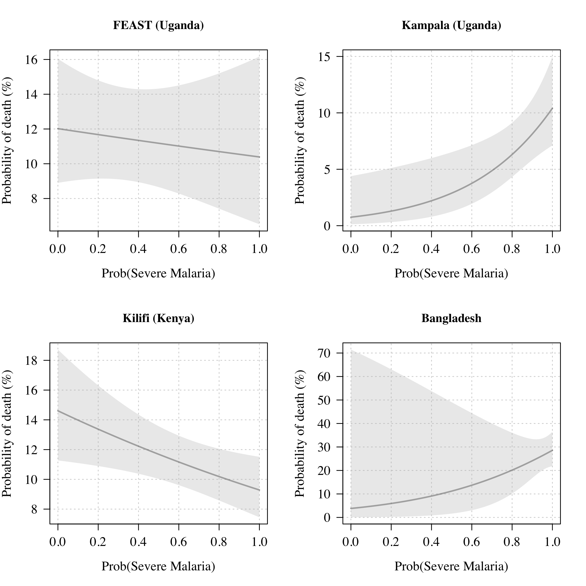

```r
library(RColorBrewer)
library(mgcv)
```

```
## Loading required package: nlme
```

```
## This is mgcv 1.8-31. For overview type 'help("mgcv-package")'.
```

```r
library(lme4)
```

```
## Loading required package: Matrix
```

```
## 
## Attaching package: 'lme4'
```

```
## The following object is masked from 'package:nlme':
## 
##     lmList
```

```r
library(mclust)
```

```
## Package 'mclust' version 5.4.6
## Type 'citation("mclust")' for citing this R package in publications.
```

```
## 
## Attaching package: 'mclust'
```

```
## The following object is masked from 'package:mgcv':
## 
##     mvn
```

```r
library(rstan)
```

```
## Loading required package: StanHeaders
```

```
## Loading required package: ggplot2
```

```
## rstan (Version 2.21.2, GitRev: 2e1f913d3ca3)
```

```
## For execution on a local, multicore CPU with excess RAM we recommend calling
## options(mc.cores = parallel::detectCores()).
## To avoid recompilation of unchanged Stan programs, we recommend calling
## rstan_options(auto_write = TRUE)
```

```r
library(gtools)
```

```
## 
## Attaching package: 'gtools'
```

```
## The following object is masked from 'package:mgcv':
## 
##     scat
```

```r
library(dplyr)
```

```
## 
## Attaching package: 'dplyr'
```

```
## The following object is masked from 'package:nlme':
## 
##     collapse
```

```
## The following objects are masked from 'package:stats':
## 
##     filter, lag
```

```
## The following objects are masked from 'package:base':
## 
##     intersect, setdiff, setequal, union
```

```r
library(reshape2)

options(mc.cores = parallel::detectCores())

RUN_STAN=F
source('functions.R')

thresh_highSM = 0.8
thresh_lowSM = 0.2


sessionInfo()
```

```
## R version 4.0.2 (2020-06-22)
## Platform: x86_64-apple-darwin17.0 (64-bit)
## Running under: macOS  10.16
## 
## Matrix products: default
## BLAS:   /Library/Frameworks/R.framework/Versions/4.0/Resources/lib/libRblas.dylib
## LAPACK: /Library/Frameworks/R.framework/Versions/4.0/Resources/lib/libRlapack.dylib
## 
## locale:
## [1] en_US.UTF-8/en_US.UTF-8/en_US.UTF-8/C/en_US.UTF-8/en_US.UTF-8
## 
## attached base packages:
## [1] stats     graphics  grDevices utils     datasets  methods   base     
## 
## other attached packages:
##  [1] reshape2_1.4.4       dplyr_1.0.0          gtools_3.8.2        
##  [4] rstan_2.21.2         ggplot2_3.3.2        StanHeaders_2.21.0-5
##  [7] mclust_5.4.6         lme4_1.1-23          Matrix_1.2-18       
## [10] mgcv_1.8-31          nlme_3.1-148         RColorBrewer_1.1-2  
## 
## loaded via a namespace (and not attached):
##  [1] Rcpp_1.0.5.1       lattice_0.20-41    prettyunits_1.1.1  ps_1.3.3          
##  [5] assertthat_0.2.1   digest_0.6.25      V8_3.2.0           R6_2.4.1          
##  [9] plyr_1.8.6         stats4_4.0.2       evaluate_0.14      pillar_1.4.6      
## [13] rlang_0.4.7        curl_4.3           minqa_1.2.4        callr_3.4.3       
## [17] nloptr_1.2.2.2     rmarkdown_2.3      splines_4.0.2      statmod_1.4.34    
## [21] stringr_1.4.0      loo_2.3.1          munsell_0.5.0      compiler_4.0.2    
## [25] xfun_0.15          pkgconfig_2.0.3    pkgbuild_1.1.0     htmltools_0.5.0   
## [29] tidyselect_1.1.0   tibble_3.0.3       gridExtra_2.3      codetools_0.2-16  
## [33] matrixStats_0.56.0 fansi_0.4.1        crayon_1.3.4       withr_2.2.0       
## [37] MASS_7.3-51.6      grid_4.0.2         jsonlite_1.7.0     gtable_0.3.0      
## [41] lifecycle_0.2.0    magrittr_1.5       scales_1.1.1       RcppParallel_5.0.2
## [45] cli_2.0.2          stringi_1.4.6      ellipsis_0.3.1     generics_0.0.2    
## [49] vctrs_0.3.2        boot_1.3-25        tools_4.0.2        glue_1.4.1        
## [53] purrr_0.3.4        processx_3.4.3     parallel_4.0.2     yaml_2.2.1        
## [57] inline_0.3.15      colorspace_1.4-1   knitr_1.29
```


# Load dataset 

## Check outliers


```r
dat_all=read.csv(file = 'dataset.csv')

writeLines(sprintf('The dataset contains %s patients with measured PfHRP2 and measured platelet counts from %s studies',
                   nrow(dat_all),
                   length(unique(dat_all$study))))
```

```
## The dataset contains 2649 patients with measured PfHRP2 and measured platelet counts from 4 studies
```

```r
African_studies = c('Kilifi (Kenya)',
                    'Kampala (Uganda)',
                    'FEAST (Uganda)')
writeLines('Patients per study:')
```

```
## Patients per study:
```

```r
print(table(dat_all$study))
```

```
## 
##       Bangladesh   FEAST (Uganda) Kampala (Uganda)   Kilifi (Kenya) 
##              172              567              492             1418
```

```r
dat_all$study_col = brewer.pal(n = 8, name = 'Dark2')[c(3,4,5,7)][as.numeric(as.factor(dat_all$study))]
mycols = adjustcolor(brewer.pal(n = 10, 'Paired')[c(2,4,6,10)], 
                     alpha.f = .7)
```


## Some data cleaning


```r
hist(dat_all$hct, breaks = 50)
```

<!-- -->

```r
# get rid of outlier HCT values
ind = which(dat_all$hct <3 | dat_all$hct>50)
dat_all$hct[ind] = NA
table(!is.na(dat_all$hct))
```

```
## 
## FALSE  TRUE 
##     6  2643
```

```r
## PfHRP2 deletions - samples with positive parasite count by negative on the elisa
ind = which(dat_all$hrp2==0 & dat_all$para > 1000)
table(dat_all$study[ind])
```

```
## 
##     Bangladesh FEAST (Uganda) Kilifi (Kenya) 
##              1              8             18
```

```r
writeLines(sprintf('A total of %s samples have zero PfHRP2 but more than 1000 parasites per uL',length(ind)))
```

```
## A total of 27 samples have zero PfHRP2 but more than 1000 parasites per uL
```

```r
dat_all = dat_all[-ind, ]

writeLines(sprintf('After excluding the HRP2 outliers, the dataset contains %s patients with measured PfHRP2 and measured platelet counts',
                   nrow(dat_all)))
```

```
## After excluding the HRP2 outliers, the dataset contains 2622 patients with measured PfHRP2 and measured platelet counts
```

## Overview of patient characteristics

Results for Table 1 in the paper

```r
table(dat_all$study)
```

```
## 
##       Bangladesh   FEAST (Uganda) Kampala (Uganda)   Kilifi (Kenya) 
##              171              559              492             1400
```

```r
table(dat_all$malaria_positive, dat_all$study)
```

```
##    
##     Bangladesh FEAST (Uganda) Kampala (Uganda) Kilifi (Kenya)
##   0          0            227                0              0
##   1        171            332              492           1400
```

```r
xx=aggregate(age ~ study, dat_all, quantile, probs=c(0.25,.5,.75))
colnames(xx$age)=c('lower','median','upper')
xx$age = round(xx$age,1)
print(xx)
```

```
##              study age.lower age.median age.upper
## 1       Bangladesh      23.5       30.0      45.0
## 2   FEAST (Uganda)       1.2        2.0       3.3
## 3 Kampala (Uganda)       2.2        3.3       4.6
## 4   Kilifi (Kenya)       1.4        2.4       3.7
```

```r
aggregate(hrp2 ~ study, dat_all, length)
```

```
##              study hrp2
## 1       Bangladesh  171
## 2   FEAST (Uganda)  559
## 3 Kampala (Uganda)  492
## 4   Kilifi (Kenya) 1400
```

```r
aggregate(outcome ~ study, dat_all, function(x) round(100*mean(x),1))
```

```
##              study outcome
## 1       Bangladesh    26.9
## 2   FEAST (Uganda)    11.4
## 3 Kampala (Uganda)     6.7
## 4   Kilifi (Kenya)    11.1
```

```r
aggregate(platelet ~ study, dat_all, quantile, probs=c(0.25,.5,.75))
```

```
##              study platelet.25% platelet.50% platelet.75%
## 1       Bangladesh         27.0         50.0        139.0
## 2   FEAST (Uganda)         74.5        165.0        326.0
## 3 Kampala (Uganda)         49.0         96.0        169.5
## 4   Kilifi (Kenya)         64.0        111.0        215.0
```

```r
aggregate(hrp2 ~ study, dat_all, quantile, probs=c(0.25,.5,.75))
```

```
##              study  hrp2.25%  hrp2.50%  hrp2.75%
## 1       Bangladesh 1082.9050 2667.0400 6127.5550
## 2   FEAST (Uganda)    0.0000  174.7100 1952.6900
## 3 Kampala (Uganda)  588.0000 1838.4000 4097.4000
## 4   Kilifi (Kenya)  418.7393 2206.7408 5071.5299
```

```r
aggregate(wbc ~ study, dat_all, quantile, probs=c(0.25,.5,.75))
```

```
##              study wbc.25% wbc.50% wbc.75%
## 1       Bangladesh   6.900   9.000  11.000
## 2   FEAST (Uganda)   8.400  11.950  18.675
## 3 Kampala (Uganda)   7.500  10.400  15.300
## 4   Kilifi (Kenya)   8.900  12.550  19.000
```

```r
ind_pos = which(dat_all$malaria_positive==1)
dat_all$log10_parasites = log10(dat_all$para+50)
xx=aggregate(para ~ study, dat_all[ind_pos, ], 
             quantile, probs=c(0.25,.5,.75))
xx$para = round(xx$para)
print(xx)
```

```
##              study para.25% para.50% para.75%
## 1       Bangladesh    23550   148874   348540
## 2   FEAST (Uganda)     3640    37600   153680
## 3 Kampala (Uganda)    10635    42530   198540
## 4   Kilifi (Kenya)     6099    69824   316350
```

```r
table(dat_all$study, dat_all$sickle)
```

```
##                   
##                       1    2    3
##   Bangladesh          0    0    0
##   FEAST (Uganda)    466   46   21
##   Kampala (Uganda)  463    4   23
##   Kilifi (Kenya)   1348   41    7
```


Correlation between the platelet count and the PfHRP2 concentration


```r
writeLines('African sites: correlation:')
```

```
## African sites: correlation:
```

```r
ind_Africa = dat_all$study %in% African_studies
res=cor.test(log10(dat_all$platelet[ind_Africa]),
             log10(dat_all$hrp2+1)[ind_Africa])
res
```

```
## 
## 	Pearson's product-moment correlation
## 
## data:  log10(dat_all$platelet[ind_Africa]) and log10(dat_all$hrp2 + 1)[ind_Africa]
## t = -31.892, df = 2449, p-value < 2.2e-16
## alternative hypothesis: true correlation is not equal to 0
## 95 percent confidence interval:
##  -0.5690929 -0.5131183
## sample estimates:
##        cor 
## -0.5417058
```

```r
log10(res$p.value)
```

```
## [1] -186.2477
```

```r
round(res$estimate,2)
```

```
##   cor 
## -0.54
```

```r
writeLines('Bangladesh: correlation:')
```

```
## Bangladesh: correlation:
```

```r
res=cor.test(log10(dat_all$platelet[!ind_Africa]),
             log10(dat_all$hrp2+1)[!ind_Africa])
res
```

```
## 
## 	Pearson's product-moment correlation
## 
## data:  log10(dat_all$platelet[!ind_Africa]) and log10(dat_all$hrp2 + 1)[!ind_Africa]
## t = -4.9404, df = 169, p-value = 1.863e-06
## alternative hypothesis: true correlation is not equal to 0
## 95 percent confidence interval:
##  -0.4797402 -0.2167256
## sample estimates:
##        cor 
## -0.3552439
```

```r
log10(res$p.value)
```

```
## [1] -5.72988
```

```r
round(res$estimate,2)
```

```
##   cor 
## -0.36
```

Summary plot of the biomarker data


```r
mycols = rep('black',4)
dat_all$log10_platelet=log10(dat_all$platelet)
ind = which(dat_all$hrp2==0)
dat_all$hrp2[ind] = 10^rnorm(length(ind),0,.1)
dat_all$log10_hrp2 = log10(dat_all$hrp2)
par(las=1, family='serif', mfrow=c(2,2),cex.lab=1.5, cex.axis=1.5)
for(cc in unique(dat_all$study)){
  plot(dat_all$log10_platelet,dat_all$log10_hrp2, 
       panel.first = grid(), xaxt='n', yaxt='n',
       xlab='Platelet count (x1000 per uL)',type='n',
       ylab='PfHRP2 (ng/mL)')
  ind = dat_all$study==cc
  title(paste(cc, ' (n=',sum(ind),')',sep = ''))
  points(dat_all$log10_platelet[ind],
         dat_all$log10_hrp2[ind], pch = 16, 
         col= adjustcolor(dat_all$study_col,.1)[ind])
  points(dat_all$log10_platelet[ind],
         dat_all$log10_hrp2[ind], pch = 1, 
         col= adjustcolor(dat_all$study_col,.5)[ind])
  axis(1, at = log10(c(10, 20,100,1000)),
       labels = c(10, 20,100,1000))
  axis(1, at = log10(seq(20, 90, by =10)), labels = NA)
  axis(1, at = log10(seq(200, 900, by =100)), labels = NA)
  axis(2, at = 0:5, 
       labels = c(1, 10, expression(10^2),expression(10^3), 
                  expression(10^4),expression(10^5)))
}
```

<!-- -->

# Fitting a mixture model to platelets and HRP2
## Two component mixture - not including FEAST

### Main model

Analysis not including the FEAST study - only severe malaria studies

```r
# make numeric matrix for stan input
ind_SMstudies = dat_all$study != 'FEAST (Uganda)' &
  !is.na(dat_all$log10_parasites)
X = dat_all[ind_SMstudies,
            c('log10_platelet',
              'log10_hrp2',
              'log10_parasites')]
site_index_SMstudies = as.numeric(as.factor(dat_all$study[ind_SMstudies]))
table(site_index_SMstudies)
```

```
## site_index_SMstudies
##    1    2    3 
##  170  484 1398
```

```r
stan_dat_all = 
  list(N = nrow(X),
       y = X,
       Ntest = ncol(X),
       K_sites = max(site_index_SMstudies),
       site = site_index_SMstudies,
       prior_mu = matrix(c(log10(75), log10(200),
                           log10(250),log10(3000),
                           3,5),
                         nrow = ncol(X), byrow = T),
       prior_sigma_mu = matrix(c(0.1, 0.1,
                                 0.2, 0.2,
                                 0.25, 0.25),
                               nrow = ncol(X), byrow = T),
       beta_prior_prev = matrix(data = c(19,1,
                                         14,7,
                                         14,7),
                                nrow = max(site_index_SMstudies),
                                byrow = T),
       cluster = matrix(data = c(1,2,
                                 2,1,
                                 2,1), 
                        nrow = ncol(X), byrow = T))

print(stan_dat_all$N)
```

```
## [1] 2052
```

```r
# just platelets and HRP2 (reference)
ind_SMstudies2 = dat_all$study != 'FEAST (Uganda)' 
X = dat_all[ind_SMstudies2,c('log10_platelet','log10_hrp2')]

stan_dat_plt_hrp2 = stan_dat_all
stan_dat_plt_hrp2$y = X
stan_dat_plt_hrp2$N = nrow(X)
stan_dat_plt_hrp2$site = as.numeric(as.factor(dat_all$study[ind_SMstudies2]))
stan_dat_plt_hrp2$Ntest = 2
stan_dat_plt_hrp2$prior_mu = stan_dat_all$prior_mu[1:2,]
stan_dat_plt_hrp2$prior_sigma_mu = stan_dat_all$prior_sigma_mu[1:2,]
stan_dat_plt_hrp2$cluster = stan_dat_all$cluster[1:2,]
```


compile the stan model

```r
# compile stan model
lc_mod = stan_model(file = 'Latent_class_continuous_2.stan')
```


Run the stan model - this is stored in Rout
We check convergence with the traceplots


```r
fname_all = paste0('Rout/', 'mod2_LC_all.stanfit')
if(RUN_STAN | !file.exists(fname_all)){
  out_all = sampling(lc_mod, data=stan_dat_all, thin=4)
  save(out_all, file = fname_all)
} else {
  load(fname_all)
}

fname_plt_hrp2 = paste0('Rout/', 'mod2_LC_plt_hrp2.stanfit')
if(RUN_STAN | !file.exists(fname_plt_hrp2)){
  out_plt_hrp2 = sampling(lc_mod, data=stan_dat_plt_hrp2, thin=4)
  save(out_plt_hrp2, file = fname_plt_hrp2)
} else {
  load(fname_plt_hrp2)
}

traceplot(out_all,par=c('prev','mu','sigma'))
```

<!-- -->

```r
traceplot(out_plt_hrp2,par=c('prev','mu','sigma'))
```

<!-- -->

```r
thetas_all = extract(out_all)
thetas_plt_hrp2 = extract(out_plt_hrp2)

round(100*colMeans(thetas_all$prev))
```

```
## [1] 98 73 67
```

```r
round(100*colMeans(thetas_plt_hrp2$prev))
```

```
## [1] 94 70 65
```

```r
mean_vals = round(10^apply(thetas_all$mu, 2:3, mean))
colnames(mean_vals) = c('SM', 'not SM')
rownames(mean_vals) = c('Platelet count','PfHRP2','Parasite count')
print(mean_vals)
```

```
##                 
##                    SM not SM
##   Platelet count   73    235
##   PfHRP2          182   3247
##   Parasite count 7584  78667
```

```r
mean_vals2 = round(10^apply(thetas_plt_hrp2$mu, 2:3, mean))
colnames(mean_vals2) = c('SM', 'not SM')
rownames(mean_vals2) = c('Platelet count','PfHRP2')
print(mean_vals2)
```

```
##                 
##                   SM not SM
##   Platelet count  70    231
##   PfHRP2         196   3415
```

```r
hist(colMeans(thetas_all$ps_SM),breaks = 20)
```

<!-- -->

```r
ind_SM = colMeans(thetas_all$ps_SM)>thresh_highSM
ind_notSM = colMeans(thetas_all$ps_SM)<thresh_lowSM
sum(ind_SM)
```

```
## [1] 1344
```

```r
sum(ind_notSM)
```

```
## [1] 463
```

```r
cor.test(stan_dat_all$y[ind_SM, 1],stan_dat_all$y[ind_SM,2])
```

```
## 
## 	Pearson's product-moment correlation
## 
## data:  stan_dat_all$y[ind_SM, 1] and stan_dat_all$y[ind_SM, 2]
## t = -2.7007, df = 1342, p-value = 0.007007
## alternative hypothesis: true correlation is not equal to 0
## 95 percent confidence interval:
##  -0.1264960 -0.0201302
## sample estimates:
##         cor 
## -0.07352218
```

```r
cor.test(stan_dat_all$y[ind_SM, 2],stan_dat_all$y[ind_SM,3])
```

```
## 
## 	Pearson's product-moment correlation
## 
## data:  stan_dat_all$y[ind_SM, 2] and stan_dat_all$y[ind_SM, 3]
## t = -4.3847, df = 1342, p-value = 1.252e-05
## alternative hypothesis: true correlation is not equal to 0
## 95 percent confidence interval:
##  -0.17122533 -0.06578923
## sample estimates:
##        cor 
## -0.1188423
```

```r
cor.test(stan_dat_all$y[ind_notSM, 1],stan_dat_all$y[ind_notSM,2])
```

```
## 
## 	Pearson's product-moment correlation
## 
## data:  stan_dat_all$y[ind_notSM, 1] and stan_dat_all$y[ind_notSM, 2]
## t = 2.1778, df = 461, p-value = 0.02992
## alternative hypothesis: true correlation is not equal to 0
## 95 percent confidence interval:
##  0.009874462 0.190294163
## sample estimates:
##       cor 
## 0.1009139
```

```r
cor.test(stan_dat_all$y[ind_notSM, 2],stan_dat_all$y[ind_notSM,3])
```

```
## 
## 	Pearson's product-moment correlation
## 
## data:  stan_dat_all$y[ind_notSM, 2] and stan_dat_all$y[ind_notSM, 3]
## t = 3.1177, df = 461, p-value = 0.001937
## alternative hypothesis: true correlation is not equal to 0
## 95 percent confidence interval:
##  0.05326703 0.23179455
## sample estimates:
##       cor 
## 0.1436997
```

```r
round(10^apply(thetas_plt_hrp2$mu, 2:3, mean))
```

```
##       
##        [,1] [,2]
##   [1,]   70  231
##   [2,]  196 3415
```

```r
round(10^(apply(thetas_plt_hrp2$mu, 2:3, mean)+ 1.96*apply(thetas_plt_hrp2$sigma, 2:3, mean)))
```

```
##       
##        [,1]  [,2]
##   [1,]  280   822
##   [2,] 5476 25279
```

```r
round(10^(apply(thetas_plt_hrp2$mu, 2:3, mean)- 1.96*apply(thetas_plt_hrp2$sigma, 2:3, mean)))
```

```
##       
##        [,1] [,2]
##   [1,]   18   65
##   [2,]    7  461
```


Check conditional independence - are the biomarkers correlated within the latent classes?


```r
par(mfrow=c(2,2), las=1)
plot(stan_dat_all$y[ind_SM, 1],stan_dat_all$y[ind_SM,2],
     xlab='Platelet count',ylab='HRP2',main='True SM',
     xlim=range(stan_dat_all$y[,1]),ylim=range(stan_dat_all$y[,2]),
     col=dat_all$study_col[ind_SM],panel.first=grid())
legend('bottomright',col = unique(dat_all$study_col), 
       legend = unique(dat_all$study),pch=1,inset=0.03)
plot(stan_dat_all$y[ind_SM, 2],stan_dat_all$y[ind_SM,3],
     xlab='HRP2', xlim=range(stan_dat_all$y[,2]),
     ylim=range(stan_dat_all$y[,3]),
     ylab='Parasite density',main='True SM',
     col=dat_all$study_col[ind_SM],panel.first=grid())
plot(stan_dat_all$y[ind_notSM, 1],stan_dat_all$y[ind_notSM,2],
     xlab='Platelet count',ylab='HRP2',main='Not SM',
     xlim=range(stan_dat_all$y[,1]),ylim=range(stan_dat_all$y[,2]),
     col=dat_all$study_col[ind_notSM],panel.first=grid())
plot(stan_dat_all$y[ind_notSM, 2],stan_dat_all$y[ind_notSM,3],
     xlim=range(stan_dat_all$y[,2]),ylim=range(stan_dat_all$y[,3]),
     xlab='HRP2',ylab='Parasite density',main='Not SM',
     col=dat_all$study_col[ind_notSM],panel.first=grid())
```

<!-- -->


### Sensitivity analysis - only African studies

Just use the two severe malaria studies from Africa

```r
# make numeric matrix for stan input
ind_SMAfrica = dat_all$study != 'FEAST (Uganda)' &
  dat_all$study != 'Bangladesh' &
  !is.na(dat_all$log10_parasites)
X = dat_all[ind_SMAfrica,
            c('log10_platelet','log10_hrp2',
              'log10_parasites')]
site_index_SMAfrica = as.numeric(as.factor(dat_all$study[ind_SMAfrica]))
table(site_index_SMAfrica)
```

```
## site_index_SMAfrica
##    1    2 
##  484 1398
```

```r
stan_dat_all_Af = 
  list(N = nrow(X),
       y = X,
       Ntest = ncol(X),
       K_sites = max(site_index_SMAfrica),
       site = site_index_SMAfrica,
       prior_mu = matrix(c(log10(75), log10(200),
                           log10(250),log10(3000),
                           3,5),
                         nrow = ncol(X), byrow = T),
       prior_sigma_mu = matrix(c(0.1, 0.1,
                                 0.1, 0.1,
                                 0.2, 0.2),
                               nrow = ncol(X), byrow = T),
       beta_prior_prev = matrix(data = c(14,7,
                                         14,7),
                                nrow = max(site_index_SMAfrica),
                                byrow = T),
       cluster = matrix(data = c(1,2,
                                 2,1,
                                 2,1), 
                        nrow = ncol(X), byrow = T))

# just platelets and HRP2 (reference)
stan_dat_plt_hrp2_Af = stan_dat_all_Af
stan_dat_plt_hrp2_Af$y = X[,1:2]
stan_dat_plt_hrp2_Af$Ntest = 2
stan_dat_plt_hrp2_Af$prior_mu = stan_dat_all_Af$prior_mu[1:2,]
stan_dat_plt_hrp2_Af$prior_sigma_mu =stan_dat_all_Af$prior_sigma_mu[1:2,]
stan_dat_plt_hrp2_Af$cluster = stan_dat_all_Af$cluster[1:2,]
```

run model and check convergence


```r
fname_all_Af = paste0('Rout/', 'mod2_LC_all_Af.stanfit')
if(RUN_STAN | !file.exists(fname_all_Af)){
  out_all_Af = sampling(lc_mod, data=stan_dat_all_Af, thin=4)
  save(out_all_Af, file = fname_all_Af)
} else {
  load(fname_all_Af)
}

fname_plt_hrp2 = paste0('Rout/', 'mod2_LC_plt_hrp2_Af.stanfit')
if(RUN_STAN | !file.exists(fname_plt_hrp2)){
  out_plt_hrp2_Af = sampling(lc_mod, data=stan_dat_plt_hrp2_Af, thin=4)
  save(out_plt_hrp2_Af, file = fname_plt_hrp2)
} else {
  load(fname_plt_hrp2)
}

traceplot(out_all_Af)
```

```
## 'pars' not specified. Showing first 10 parameters by default.
```

<!-- -->

```r
traceplot(out_plt_hrp2_Af)
```

```
## 'pars' not specified. Showing first 10 parameters by default.
```

<!-- -->

```r
thetas_all_Af = extract(out_all_Af)
thetas_plt_hrp2_Af = extract(out_plt_hrp2_Af)

round(100*colMeans(thetas_all_Af$prev))
```

```
## [1] 71 66
```

```r
round(100*colMeans(thetas_plt_hrp2_Af$prev))
```

```
## [1] 69 64
```

```r
mean_vals = round(10^apply(thetas_all_Af$mu, 2:3, mean))
colnames(mean_vals) = c('SM', 'not SM')
rownames(mean_vals) = c('Platelet count','PfHRP2','Parasite count')
print(mean_vals)
```

```
##                 
##                    SM not SM
##   Platelet count   75    231
##   PfHRP2          193   3398
##   Parasite count 7617  80408
```

```r
mean_vals2 = round(10^apply(thetas_plt_hrp2_Af$mu, 2:3, mean))
colnames(mean_vals2) = c('SM', 'not SM')
rownames(mean_vals2) = c('Platelet count','PfHRP2')
print(mean_vals2)
```

```
##                 
##                   SM not SM
##   Platelet count  73    228
##   PfHRP2         208   3556
```


### ROC curves comparing model fits

All model 2 ROC curves

```r
par(mfcol=c(2,2),las=1,cex.lab=1.3,cex.axis=1.3,family='serif')
roc_analysis(thetas = thetas_all, stan_dat = stan_dat_all,
             xvals = matrix(c(log10(10),log10(1000),
                              1,5,1,6.5),
                            nrow = 3,byrow = T),
             xnames = c('Platelet count (x1000 per uL)',
                        'PfHRP2 (ng/mL)',
                        'Parasite count (per uL)'),
             cutofftype = c('upper','lower','lower'),
             mycuts = log10(c(150, 1000, 10000)))
```

```
## [1] "Platelet count (x1000 per uL)"
## [1] 84
## [1] 75
## [1] "PfHRP2 (ng/mL)"
## [1] 87
## [1] 84
## [1] "Parasite count (per uL)"
## [1] 84
## [1] 55
```

```
## Warning in plot.xy(xy.coords(x, y), type = type, ...): "log" is not a graphical
## parameter

## Warning in plot.xy(xy.coords(x, y), type = type, ...): "log" is not a graphical
## parameter

## Warning in plot.xy(xy.coords(x, y), type = type, ...): "log" is not a graphical
## parameter
```

<!-- -->

```r
# sensitivity analysis using African studies only
writeLines('Model using only African studies')
```

```
## Model using only African studies
```

```r
roc_analysis(thetas = thetas_all_Af,
             stan_dat = stan_dat_all_Af,
             xvals = matrix(c(log10(10),log10(300),
                              1,5,1,6.3),
                            nrow = 3,byrow = T),
             xnames = c('Platelet count (x1000 per uL)',
                        'PfHRP2 (ng/mL)',
                        'Parasite count (per uL)'),
             cutofftype = c('upper','lower','lower'),
             mycuts = log10(c(150, 1000, 10000)))
```

```
## [1] "Platelet count (x1000 per uL)"
## [1] 85
## [1] 74
## [1] "PfHRP2 (ng/mL)"
## [1] 89
## [1] 83
## [1] "Parasite count (per uL)"
## [1] 85
## [1] 55
```

```
## Warning in plot.xy(xy.coords(x, y), type = type, ...): "log" is not a graphical
## parameter

## Warning in plot.xy(xy.coords(x, y), type = type, ...): "log" is not a graphical
## parameter

## Warning in plot.xy(xy.coords(x, y), type = type, ...): "log" is not a graphical
## parameter
```

<!-- -->

```r
writeLines('Model using only platelets and HRP2')
```

```
## Model using only platelets and HRP2
```

```r
par(mfcol=c(2,2),las=1,cex.lab=1.3,cex.axis=1.3,family='serif')
roc_analysis(thetas = thetas_plt_hrp2, stan_dat = stan_dat_plt_hrp2,
             xvals = matrix(c(log10(10),log10(1000),1,5),
                            nrow = 2,byrow = T),
             xnames = c('Platelet count (x1000 per uL)',
                        'PfHRP2 (ng/mL)'),
             cutofftype = c('upper','lower'))
```

```
## Warning in plot.xy(xy.coords(x, y), type = type, ...): "log" is not a graphical
## parameter

## Warning in plot.xy(xy.coords(x, y), type = type, ...): "log" is not a graphical
## parameter
```

<!-- -->


## Three component mixture - including FEAST


```r
lc3_mod = stan_model(file = 'Latent_class_continuous_3.stan')
```

This does not fit when we add parasite counts. So we are only using two biomarkers


```r
# make numeric matrix for stan input
X = dat_all[, c('log10_platelet','log10_hrp2')]
site_index = as.numeric(as.factor(dat_all$study))
table(site_index, dat_all$study)
```

```
##           
## site_index Bangladesh FEAST (Uganda) Kampala (Uganda) Kilifi (Kenya)
##          1        171              0                0              0
##          2          0            559                0              0
##          3          0              0              492              0
##          4          0              0                0           1400
```

```r
stan_dat = 
  list(N = nrow(X),
       y = X,
       Ntest = ncol(X),
       K_sites = max(site_index),
       site = site_index,
       prior_mu = matrix(c(log10(75), log10(200),log10(300),
                           log10(2),log10(250),log10(3000)),
                         nrow = ncol(X),ncol = 3, byrow = T),
       prior_sigma_mu = matrix(c(0.1, 0.1, 0.1,
                                 0.1, 0.1, 0.1),
                               nrow = ncol(X), ncol = 3, byrow = T),
       alpha_prior = matrix(data = c(19, 1, .1,
                                     3,  3, 3,
                                     14, 7, 1,
                                     14, 7, 1),
                            nrow = max(site_index),
                            byrow = T),
       cluster = matrix(data = c(1,2,3,
                                 3,2,1), 
                        nrow = ncol(X), ncol = 3, byrow = T))

fname_final = paste0('Rout/', 'mod3_LC_final.stanfit')
if(RUN_STAN | !file.exists(fname_final)){
  out_final = sampling(lc3_mod, data = stan_dat, iter=2000,thin=4)
  save(out_final, file = fname_final)
} else {
  load(fname_final)
}

traceplot(out_final, par=c('theta'))
```

<!-- -->

```r
thetas_final = extract(out_final)

writeLines('Estimated prevalences across the 4 studies:\n')
```

```
## Estimated prevalences across the 4 studies:
```

```r
round(100*apply(thetas_final$theta[, ,1], 2, 
                quantile, probs=c(.025, 0.5, 0.975)),1)
```

```
##       [,1] [,2] [,3] [,4]
## 2.5%  87.6 30.4 64.2 61.1
## 50%   93.8 35.1 69.7 64.7
## 97.5% 97.9 39.9 74.6 68.1
```

```r
c_mean=round(10^apply(thetas_final$mu, 2:3, mean))

c_upper=round(10^(apply(thetas_final$mu, 2:3, mean)+ 1.96*apply(thetas_final$sigma, 2:3, mean)))

c_lower=round(10^(apply(thetas_final$mu, 2:3, mean)- 1.96*apply(thetas_final$sigma, 2:3, mean)))

writeLines(sprintf('In SM the 95%% pred interval for the platelet count is %s to %s with a mean of %s',c_lower[1,1],c_upper[1,1],c_mean[1,1] ))
```

```
## In SM the 95% pred interval for the platelet count is 21 to 235 with a mean of 70
```

```r
writeLines(sprintf('In SM the 95%% pred interval for the PfHRP2 concentration is %s to %s with a mean of %s',c_lower[2,3],c_upper[2,3],c_mean[2,3] ))
```

```
## In SM the 95% pred interval for the PfHRP2 concentration is 570 to 19718 with a mean of 3352
```

```r
ind_not_FEAST = stan_dat$site != 2
plot(colMeans(thetas_final$ps_SM)[ind_not_FEAST],
     colMeans(thetas_plt_hrp2$ps_SM))
lines(0:1, 0:1)
```

<!-- -->

### Conditional independence check

Check conditional independence

```r
ps = apply(thetas_final$ps_comp, 2:3, mean)
ind_SM = ps[,1]>0.5; sum(ind_SM)
```

```
## [1] 1635
```

```r
ind_1 = ps[,2]>0.5; sum(ind_1)
```

```
## [1] 793
```

```r
ind_2 = ps[,3]>0.5; sum(ind_2)
```

```
## [1] 194
```

```r
par(mfrow=c(2,2), las=1)
plot(stan_dat$y[ind_SM, 1],stan_dat$y[ind_SM,2],
     xlab='Platelet count (x1000 per uL)',
     ylab='PfHRP2 (ng/mL)',main='Severe malaria',
     xlim=range(stan_dat$y[,1]),ylim=range(stan_dat$y[,2]),
     col = dat_all$study_col[ind_SM],panel.first=grid())
cor.test(stan_dat$y[ind_SM, 1],stan_dat$y[ind_SM,2])
```

```
## 
## 	Pearson's product-moment correlation
## 
## data:  stan_dat$y[ind_SM, 1] and stan_dat$y[ind_SM, 2]
## t = -2.0615, df = 1633, p-value = 0.03941
## alternative hypothesis: true correlation is not equal to 0
## 95 percent confidence interval:
##  -0.09918144 -0.00247591
## sample estimates:
##        cor 
## -0.0509481
```

```r
legend('bottomright',col = unique(dat_all$study_col), 
       legend = unique(dat_all$study),pch=1,inset=0.03)

plot(stan_dat$y[ind_1, 1],stan_dat$y[ind_1,2],
     xlab='Platelet count (x1000 per uL)',
     ylab='PfHRP2 (ng/mL)',main='Not severe malaria (component 1)',
     xlim=range(stan_dat$y[,1]),ylim=range(stan_dat$y[,2]),
     col = dat_all$study_col[ind_1],panel.first=grid())
cor.test(stan_dat$y[ind_1, 1],stan_dat$y[ind_1,2])
```

```
## 
## 	Pearson's product-moment correlation
## 
## data:  stan_dat$y[ind_1, 1] and stan_dat$y[ind_1, 2]
## t = 1.2474, df = 791, p-value = 0.2126
## alternative hypothesis: true correlation is not equal to 0
## 95 percent confidence interval:
##  -0.0253879  0.1135792
## sample estimates:
##     cor 
## 0.04431
```

```r
plot(stan_dat$y[ind_2, 1],stan_dat$y[ind_2,2],
     xlab='Platelet count (x1000 per uL)',
     ylab='PfHRP2 (ng/mL)',main='Not severe malaria (component 2)',
     xlim=range(stan_dat$y[,1]),ylim=range(stan_dat$y[,2]),
     col = dat_all$study_col[ind_2],panel.first=grid())
cor.test(stan_dat$y[ind_2, 1],stan_dat$y[ind_2,2])
```

```
## 
## 	Pearson's product-moment correlation
## 
## data:  stan_dat$y[ind_2, 1] and stan_dat$y[ind_2, 2]
## t = -1.0062, df = 192, p-value = 0.3156
## alternative hypothesis: true correlation is not equal to 0
## 95 percent confidence interval:
##  -0.21114268  0.06915841
## sample estimates:
##         cor 
## -0.07242201
```

<!-- -->


### ROC curves


```r
par(mfcol=c(2,2),las=1,cex.lab=1.3,cex.axis=1.3,family='serif')
roc_analysis(thetas = thetas_final, stan_dat = stan_dat,
             xvals = matrix(c(log10(10),log10(1000),1,5),
                            nrow = 2,byrow = T),
             xnames = c('Platelet count (x1000 per uL)',
                        'PfHRP2 (ng/mL)'),
             cutofftype = c('upper','lower'))
```

```
## Warning in plot.xy(xy.coords(x, y), type = type, ...): "log" is not a graphical
## parameter

## Warning in plot.xy(xy.coords(x, y), type = type, ...): "log" is not a graphical
## parameter
```

<!-- -->

Make a P(SM) variable for subsequent analysis (continuous) and a discrete classification based on a cutoff of 0.5

```r
dat_all$P_SM = colMeans(thetas_final$ps_SM)
dat_all$SM = as.numeric(dat_all$P_SM>0.5)
hist(dat_all$P_SM, breaks = 20,main='Final model', xlab='P(SM)')
```

<!-- -->


# Downstream analyses

## Severe malaria probability and subphenotypes

Relationship with the two main subphenotypes, cerebral malaria and severe malaria anaemia

```r
writeLines('False diagnosis rate by coma status and by study:')
```

```
## False diagnosis rate by coma status and by study:
```

```r
print(aggregate(SM ~ coma + study, data = dat_all, mean))
```

```
##   coma            study        SM
## 1    0       Bangladesh 0.9841270
## 2    1       Bangladesh 0.9629630
## 3    0   FEAST (Uganda) 0.3333333
## 4    1   FEAST (Uganda) 0.4311927
## 5    0 Kampala (Uganda) 0.5131579
## 6    1 Kampala (Uganda) 0.8636364
## 7    0   Kilifi (Kenya) 0.7113402
## 8    1   Kilifi (Kenya) 0.6212121
```

```r
writeLines('True diagnosis rate by severe anaemia status (<15% haematocrit) and by study:')
```

```
## True diagnosis rate by severe anaemia status (<15% haematocrit) and by study:
```

```r
dat_all$SMA = as.numeric(dat_all$hct<=15)
print(aggregate(SM ~ SMA + study, data = dat_all,mean))
```

```
##   SMA            study        SM
## 1   0       Bangladesh 0.9691358
## 2   1       Bangladesh 1.0000000
## 3   0   FEAST (Uganda) 0.3357488
## 4   1   FEAST (Uganda) 0.4125874
## 5   0 Kampala (Uganda) 0.8516949
## 6   1 Kampala (Uganda) 0.5625000
## 7   0   Kilifi (Kenya) 0.6199461
## 8   1   Kilifi (Kenya) 0.8280702
```


```r
par(las = 1, family='serif',mfrow=c(2,2), cex.lab=1.3,
    cex.axis=1.3)
n_levels = 11
f=colorRampPalette(colors = RColorBrewer::brewer.pal(name = 'RdYlBu',n = n_levels))
mycuts = cut(x = dat_all$P_SM, breaks = seq(0,1,by=1/n_levels))
cols_ind = as.numeric(mycuts)
mycols = f(n_levels)

for(cc in unique(dat_all$study)){
  ind = dat_all$study==cc
  plot(X, type='n',
       panel.first=grid(), 
       xlab='Platelet count (x1000 per uL)', 
       ylab='PfHRP2 (ng/mL)', xaxt='n', yaxt='n')
  points(X[ind, ],  pch=1,
         col= adjustcolor(mycols[cols_ind],.7)[ind])
  points(X[ind, ],  pch=16,
         col= adjustcolor(mycols[cols_ind],.4)[ind])
  if(cc %in% African_studies){
    ind_AS = dat_all$sickle==2
    points(X[ind&ind_AS, ],pch=2)
    ind_SS = dat_all$sickle==3
    points(X[ind&ind_SS, ],pch=3)
  }
  title(cc)
  axis(1, at = log10(c(10, 20,100,200,1000)),
       labels = c(10, 20,100,200,1000))
  axis(1, at = log10(seq(20, 100, by =10)), 
       labels = NA)
  axis(1, at = log10(seq(200, 1000, by =100)), 
       labels = NA)
  axis(2, at = 0:5, 
       labels = c(1, 10, 
                  expression(10^2),
                  expression(10^3), 
                  expression(10^4),
                  expression(10^5)))
  
}
table(sickle=dat_all$sickle, 
      class=dat_all$SM, 
      study=dat_all$study)
```

```
## , , study = Bangladesh
## 
##       class
## sickle   0   1
##      1   0   0
##      2   0   0
##      3   0   0
## 
## , , study = FEAST (Uganda)
## 
##       class
## sickle   0   1
##      1 284 182
##      2  40   6
##      3  20   1
## 
## , , study = Kampala (Uganda)
## 
##       class
## sickle   0   1
##      1 126 337
##      2   2   2
##      3  19   4
## 
## , , study = Kilifi (Kenya)
## 
##       class
## sickle   0   1
##      1 437 911
##      2  27  14
##      3   6   1
```

```r
lgd_ = rep(NA, n_levels)
lgd_[c(1,6,11)] = c(1,0.5,0)
legend('bottomleft',
       legend = lgd_,
       fill = rev(mycols),bty='n',x.intersp =.5,
       border = NA,inset = 0.01,
       y.intersp = 0.5,title = '',
       cex = 1, text.font = 1)

legend('bottomright',pch=2:3, legend = c('HbAS','HbSS'),inset=0.03)
```

<!-- -->

## Parasite densities


```r
### Parasite counts
ind_neg = dat_all$malaria_positive
par(las = 1, family='serif',mfrow=c(2,2), cex.lab=1.3, cex.axis=1.3)
for(cc in unique(dat_all$study)){
  ind = dat_all$study==cc
  set.seed(7475)
  myxs=dat_all$P_SM[ind]
  myys=log10(dat_all$para+10^1.7)[ind]
  plot(myxs,myys, panel.first=grid(), ylim =c(1.5,6.5),
       pch=1, xlim=c(0,1),
       col = adjustcolor('black',.4),
       xlab='Prob(Severe Malaria)', 
       ylab='Parasite density per uL',yaxt='n')
  points(myxs,myys,pch=16,col = adjustcolor('black',.1))
  # axis(1, at=1:3,labels = c('A','B','C'), tick = F)
  axis(2, at = 2:6, 
       labels = c(expression(10^2),
                  expression(10^3), 
                  expression(10^4),
                  expression(10^5),
                  expression(10^6)))
  mod=gam(myys ~ s(myxs,k=3),
          data=data.frame(myys=myys,myxs=myxs))
  pxs=seq(0,1,length.out = 100)
  lines(pxs,predict(mod, data.frame(myxs=pxs)),lwd=3)
  title(cc)
}
```

<!-- -->


## Admission haematocrits


```r
par(las = 1, family='serif',mfrow=c(2,2), cex.lab=1.3, cex.axis=1.3)
for(cc in unique(dat_all$study)){
  ind = dat_all$study==cc
  set.seed(7475)
  myxs=(dat_all$P_SM)[ind]
  myys=jitter(dat_all$hct[ind], amount = .1)
  plot(myxs,myys,panel.first=grid(), 
       ylim = range(dat_all$hct,na.rm = T),
       pch=1, xlim=c(0,1),
       col = adjustcolor('black',.4),
       xlab='Prob(Severe Malaria)',
       ylab='Haematocrit (%)')
  points(myxs,myys,pch=16,col = adjustcolor('black',.1))
  mod=gam(myys ~ s(myxs,k=3),
          data=data.frame(myys=myys,myxs=myxs))
  pxs=seq(0,1,length.out = 100)
  lines(pxs,predict(mod, data.frame(myxs=pxs)),lwd=3)
  title(cc)
}
```

<!-- -->

```r
hct_subgroups = aggregate(hct ~ SM + study, 
                          dat_all, median)
print(hct_subgroups)
```

```
##   SM            study  hct
## 1  0       Bangladesh 35.0
## 2  1       Bangladesh 27.3
## 3  0   FEAST (Uganda) 30.0
## 4  1   FEAST (Uganda) 19.2
## 5  0 Kampala (Uganda) 12.2
## 6  1 Kampala (Uganda) 15.8
## 7  0   Kilifi (Kenya) 27.5
## 8  1   Kilifi (Kenya) 19.4
```

```r
# Severe anaemia
SA_subgroups = aggregate(hct ~ SM + study, 
                         dat_all, function(x) round(100*mean(x<15),1))
print(SA_subgroups)
```

```
##   SM            study  hct
## 1  0       Bangladesh  0.0
## 2  1       Bangladesh  4.2
## 3  0   FEAST (Uganda) 21.7
## 4  1   FEAST (Uganda) 27.8
## 5  0 Kampala (Uganda) 76.2
## 6  1 Kampala (Uganda) 41.7
## 7  0   Kilifi (Kenya) 10.2
## 8  1   Kilifi (Kenya) 24.6
```

```r
ind_SM = dat_all$P_SM > thresh_highSM
ind_notSM = dat_all$P_SM < thresh_lowSM
par(mfcol=c(2,3))
for(cc in c("FEAST (Uganda)","Kampala (Uganda)", "Kilifi (Kenya)")){
  ind = dat_all$study==cc
  
  hist(dat_all$hct[ind_SM&ind], breaks = seq(0,50, by=1),
       xlab='Haematocrit (%)', ylab='Number of patients',
       main = paste0(cc,': ', 'P(SM)>0.8'),
       panel.first=grid())
  abline(v=median(dat_all$hct[ind_SM&ind],na.rm=T),lwd=2, col='red')
  print(median(dat_all$hct[ind_SM&ind],na.rm=T))
  hist(dat_all$hct[ind_notSM&ind], breaks = seq(0,50, by=1),
       xlab='Haematocrit (%)', ylab='Number of patients',
       main = paste0(cc,': ', 'P(SM)<0.2'),
       panel.first=grid())
  abline(v=median(dat_all$hct[ind_notSM&ind],na.rm=T),lwd=2, col='red')
  print(median(dat_all$hct[ind_notSM&ind],na.rm=T))
}
```

```
## [1] 19.2
```

```
## [1] 31
```

```
## [1] 17
```

```
## [1] 11.6
```

```
## [1] 19.4
```

<!-- -->

```
## [1] 28.35
```


## Mortality


P(Severe malaria) and mortality

```r
par(las = 1, family='serif',mfrow=c(2,2), cex.lab=1.3, cex.axis=1.3)
for(cc in unique(dat_all$study)){
  ind = dat_all$study==cc
  set.seed(7475)
  xs = seq(0,1,length.out = 100)
  mod=glm(outcome ~ P_SM, family='binomial', data = dat_all[ind, ])
  print(summary(mod))
  preds=predict(mod,newdata = data.frame(P_SM=xs),se.fit = T)
  plot(xs,100*inv.logit(preds$fit),panel.first=grid(), 
       type='l',lwd=2,  col = adjustcolor('black',.4),
       xlab='Prob(Severe Malaria)',
       ylim = range(100*inv.logit(c(preds$fit+1.96*preds$se.fit,
                                    rev(preds$fit-1.96*preds$se.fit)))),
       ylab='Probability of death (%)')
  polygon(x = c(xs, rev(xs)), 
          y = 100*inv.logit(c(preds$fit+1.96*preds$se.fit,
                              rev(preds$fit-1.96*preds$se.fit))),
          col=adjustcolor('grey', .3), border = NA)
  title(cc)
}
```

```
## 
## Call:
## glm(formula = outcome ~ P_SM, family = "binomial", data = dat_all[ind, 
##     ])
## 
## Deviance Residuals: 
##     Min       1Q   Median       3Q      Max  
## -0.5023  -0.5023  -0.4983  -0.4766   2.1132  
## 
## Coefficients:
##             Estimate Std. Error z value Pr(>|z|)    
## (Intercept)  -2.0067     0.1693 -11.854   <2e-16 ***
## P_SM         -0.1129     0.3111  -0.363    0.717    
## ---
## Signif. codes:  0 '***' 0.001 '**' 0.01 '*' 0.05 '.' 0.1 ' ' 1
## 
## (Dispersion parameter for binomial family taken to be 1)
## 
##     Null deviance: 397.79  on 558  degrees of freedom
## Residual deviance: 397.65  on 557  degrees of freedom
## AIC: 401.65
## 
## Number of Fisher Scoring iterations: 4
```

```
## 
## Call:
## glm(formula = outcome ~ P_SM, family = "binomial", data = dat_all[ind, 
##     ])
## 
## Deviance Residuals: 
##     Min       1Q   Median       3Q      Max  
## -0.4602  -0.4568  -0.4184  -0.1625   3.0445  
## 
## Coefficients:
##             Estimate Std. Error z value Pr(>|z|)    
## (Intercept)  -4.6411     0.7967  -5.826 5.69e-09 ***
## P_SM          2.4517     0.8583   2.856  0.00428 ** 
## ---
## Signif. codes:  0 '***' 0.001 '**' 0.01 '*' 0.05 '.' 0.1 ' ' 1
## 
## (Dispersion parameter for binomial family taken to be 1)
## 
##     Null deviance: 242.07  on 491  degrees of freedom
## Residual deviance: 228.40  on 490  degrees of freedom
## AIC: 232.4
## 
## Number of Fisher Scoring iterations: 7
```

```
## 
## Call:
## glm(formula = outcome ~ P_SM, family = "binomial", data = dat_all[ind, 
##     ])
## 
## Deviance Residuals: 
##     Min       1Q   Median       3Q      Max  
## -0.5560  -0.5223  -0.4482  -0.4442   2.1756  
## 
## Coefficients:
##             Estimate Std. Error z value Pr(>|z|)    
## (Intercept)  -1.7887     0.1435 -12.465   <2e-16 ***
## P_SM         -0.4800     0.1985  -2.418   0.0156 *  
## ---
## Signif. codes:  0 '***' 0.001 '**' 0.01 '*' 0.05 '.' 0.1 ' ' 1
## 
## (Dispersion parameter for binomial family taken to be 1)
## 
##     Null deviance: 974.42  on 1399  degrees of freedom
## Residual deviance: 968.68  on 1398  degrees of freedom
## AIC: 972.68
## 
## Number of Fisher Scoring iterations: 4
```

```
## 
## Call:
## glm(formula = outcome ~ P_SM, family = "binomial", data = dat_all[ind, 
##     ])
## 
## Deviance Residuals: 
##     Min       1Q   Median       3Q      Max  
## -0.8060  -0.8059  -0.8013   1.6016   1.7483  
## 
## Coefficients:
##             Estimate Std. Error z value Pr(>|z|)
## (Intercept)  -1.6335     1.1108  -1.471    0.141
## P_SM          0.6758     1.1645   0.580    0.562
## 
## (Dispersion parameter for binomial family taken to be 1)
## 
##     Null deviance: 199.14  on 170  degrees of freedom
## Residual deviance: 198.77  on 169  degrees of freedom
## AIC: 202.77
## 
## Number of Fisher Scoring iterations: 4
```

<!-- -->


Summary of lab values by inferred subgroup

```r
age_subgroups = aggregate(age ~ SM + study, 
                          dat_all, function(x) round(median(x),1))
print(age_subgroups)
```

```
##   SM            study  age
## 1  0       Bangladesh 26.0
## 2  1       Bangladesh 30.0
## 3  0   FEAST (Uganda)  1.8
## 4  1   FEAST (Uganda)  2.4
## 5  0 Kampala (Uganda)  3.3
## 6  1 Kampala (Uganda)  3.3
## 7  0   Kilifi (Kenya)  2.3
## 8  1   Kilifi (Kenya)  2.4
```

```r
para_subgroups = aggregate(log10_parasites ~ SM + study, 
                           dat_all, function(x) round(mean(x),1))
para_subgroups$log10_parasites=round(10^para_subgroups$log10_parasites)
print(para_subgroups)
```

```
##   SM            study log10_parasites
## 1  0       Bangladesh          100000
## 2  1       Bangladesh           79433
## 3  0   FEAST (Uganda)             316
## 4  1   FEAST (Uganda)           39811
## 5  0 Kampala (Uganda)           12589
## 6  1 Kampala (Uganda)           50119
## 7  0   Kilifi (Kenya)           12589
## 8  1   Kilifi (Kenya)           79433
```

```r
dat_all$log10_wbc = log10(dat_all$wbc)
wbc_subgroups = aggregate(log10_wbc ~ SM + study, 
                          dat_all, function(x) round(mean(x),1))
wbc_subgroups$log10_wbc=round(10^wbc_subgroups$log10_wbc)
print(wbc_subgroups)
```

```
##   SM            study log10_wbc
## 1  0       Bangladesh         8
## 2  1       Bangladesh         8
## 3  0   FEAST (Uganda)        13
## 4  1   FEAST (Uganda)        10
## 5  0 Kampala (Uganda)        13
## 6  1 Kampala (Uganda)        10
## 7  0   Kilifi (Kenya)        16
## 8  1   Kilifi (Kenya)        13
```

```r
hbb_subgroups = aggregate(sickle ~ SM + study, 
                          dat_all, table)
print(hbb_subgroups)
```

```
##   SM            study sickle.1 sickle.2 sickle.3
## 1  0   FEAST (Uganda)      284       40       20
## 2  1   FEAST (Uganda)      182        6        1
## 3  0 Kampala (Uganda)      126        2       19
## 4  1 Kampala (Uganda)      337        2        4
## 5  0   Kilifi (Kenya)      437       27        6
## 6  1   Kilifi (Kenya)      911       14        1
```

```r
death_subgroups = aggregate(outcome ~ SM + study, 
                            dat_all, function(x) round(100*mean(x),1))
print(death_subgroups)
```

```
##   SM            study outcome
## 1  0       Bangladesh     0.0
## 2  1       Bangladesh    27.7
## 3  0   FEAST (Uganda)    11.6
## 4  1   FEAST (Uganda)    11.1
## 5  0 Kampala (Uganda)     1.4
## 6  1 Kampala (Uganda)     9.0
## 7  0   Kilifi (Kenya)    13.9
## 8  1   Kilifi (Kenya)     9.6
```

## Total white blood cell counts


```r
par(las = 1, family='serif',mfrow=c(2,2), cex.lab=1.3, cex.axis=1.3)
for(cc in unique(dat_all$study)){
  ind = dat_all$study==cc
  set.seed(7475)
  myxs=(dat_all$P_SM)[ind]
  myys=log10(dat_all$wbc[ind])
  plot(myxs,myys,panel.first=grid(), 
       ylim = range(log10(dat_all$wbc),na.rm = T),
       pch=1, xlim=c(0,1), yaxt='n',
       col = adjustcolor('black',.4),
       xlab='Prob(Severe Malaria)',
       ylab='White blood cell count (x1000 per uL)')
  axis(2, at = log10(c(1,3,10,30,100)), labels = c(1,3,10,30,100))
  points(myxs,myys,pch=16,col = adjustcolor('black',.1))
  mod=gam(myys ~ s(myxs,k=3),
          data=data.frame(myys=myys,myxs=myxs))
  pxs=seq(0,1,length.out = 100)
  lines(pxs,predict(mod, data.frame(myxs=pxs)),lwd=3)
  title(cc)
}
```

<!-- -->

```r
mod_wbc = lm(log10_wbc ~ study + SM + age, data = dat_all)
xx=summary(mod_wbc)
xx$coefficients
```

```
##                           Estimate  Std. Error    t value      Pr(>|t|)
## (Intercept)            1.287494636 0.045524542  28.281331 9.516183e-154
## studyFEAST (Uganda)   -0.124753261 0.043503756  -2.867643  4.168538e-03
## studyKampala (Uganda) -0.142630933 0.042142174  -3.384518  7.235529e-04
## studyKilifi (Kenya)   -0.069474443 0.042020916  -1.653330  9.838379e-02
## SM                    -0.121163979 0.010854018 -11.163053  2.669766e-28
## age                   -0.006631417 0.001184684  -5.597624  2.399319e-08
```

```r
10^(-xx$coefficients['SM',1])
```

```
## [1] 1.321795
```

```r
ind_mal = dat_all$malaria_positive==1
mod_wbc2 = gam(as.numeric(wbc>15) ~ study + SM + s(age,k=3),
               family='binomial',
               data = dat_all[ind_mal, ])
xx=summary(mod_wbc2)
xx$p.pv
```

```
##           (Intercept)   studyFEAST (Uganda) studyKampala (Uganda) 
##          9.341700e-06          5.887000e-08          1.547499e-08 
##   studyKilifi (Kenya)                    SM 
##          1.509999e-06          6.836982e-16
```

```r
round(exp(xx$coefficients['SM',1] + c(-1,0,1)*xx$coefficients['SM',2]),2)
```

```
## numeric(0)
```

```r
table(dat_all$study, dat_all$wbc > 15)
```

```
##                   
##                    FALSE TRUE
##   Bangladesh         149   22
##   FEAST (Uganda)     354  204
##   Kampala (Uganda)   365  126
##   Kilifi (Kenya)     870  530
```


## Bacteraemia

Relationship between the blood culture data and the probability of severe malaria.
We also look at whether WBC values predict positive blood culture


```r
table(dat_all$SM, dat_all$BS, dat_all$study)
```

```
## , ,  = Bangladesh
## 
##    
##       0   1
##   0   0   0
##   1   0   0
## 
## , ,  = FEAST (Uganda)
## 
##    
##       0   1
##   0 278  39
##   1 160  18
## 
## , ,  = Kampala (Uganda)
## 
##    
##       0   1
##   0   0   0
##   1   0   0
## 
## , ,  = Kilifi (Kenya)
## 
##    
##       0   1
##   0 445  29
##   1 904  22
```

```r
ind_FEAST = dat_all$study=='FEAST (Uganda)'
ind_Kenya = dat_all$study=='Kilifi (Kenya)'
ind_mal = dat_all$malaria_positive==1

table(dat_all$BS[ind_FEAST], useNA = 'ifany')
```

```
## 
##    0    1 <NA> 
##  438   57   64
```

```r
table(dat_all$BS[ind_FEAST&ind_mal], useNA = 'ifany')
```

```
## 
##    0    1 <NA> 
##  263   35   34
```

```r
table(dat_all$BS[ind_Kenya], useNA = 'ifany')
```

```
## 
##    0    1 
## 1349   51
```

```r
mean(!is.na(dat_all$BS[ind_FEAST]))
```

```
## [1] 0.8855098
```

```r
mod = glm(BS ~ SM + study, family='binomial',
        data = dat_all[ind_mal, ])
summary(mod)$coefficients
```

```
##                       Estimate Std. Error   z value     Pr(>|z|)
## (Intercept)         -1.6028546  0.2072216 -7.734980 1.034197e-14
## SM                  -0.7970797  0.2252927 -3.537974 4.032097e-04
## studyKilifi (Kenya) -1.2148206  0.2312284 -5.253768 1.490182e-07
```

```r
summary(glm(BS ~ SM, family='binomial',
            data = dat_all[ind_FEAST&ind_mal,])
        )$coefficients
```

```
##               Estimate Std. Error   z value     Pr(>|z|)
## (Intercept) -1.7443572  0.2554688 -6.828065 8.606784e-12
## SM          -0.4976032  0.3610010 -1.378398 1.680804e-01
```

```r
summary(glm(BS ~ SM, family='binomial',
            data = dat_all[ind_Kenya,])
        )$coefficients
```

```
##               Estimate Std. Error    z value     Pr(>|z|)
## (Intercept) -2.7307785  0.1916506 -14.248735 4.564769e-46
## SM          -0.9850085  0.2885987  -3.413074 6.423459e-04
```

```r
xx=summary(mod)$coefficients
round(exp(xx[2,1] + c(-1,0,1)*1.96* xx[2,2]),2)
```

```
## [1] 0.29 0.45 0.70
```

```r
summary(glm(BS ~ log10_wbc + study, family='binomial',
            data = dat_all[ind_mal, ]))
```

```
## 
## Call:
## glm(formula = BS ~ log10_wbc + study, family = "binomial", data = dat_all[ind_mal, 
##     ])
## 
## Deviance Residuals: 
##     Min       1Q   Median       3Q      Max  
## -0.5252  -0.2777  -0.2727  -0.2696   2.6240  
## 
## Coefficients:
##                     Estimate Std. Error z value Pr(>|z|)    
## (Intercept)          -2.1515     0.4822  -4.462 8.11e-06 ***
## log10_wbc             0.1247     0.4127   0.302    0.762    
## studyKilifi (Kenya)  -1.2638     0.2303  -5.488 4.08e-08 ***
## ---
## Signif. codes:  0 '***' 0.001 '**' 0.01 '*' 0.05 '.' 0.1 ' ' 1
## 
## (Dispersion parameter for binomial family taken to be 1)
## 
##     Null deviance: 680.62  on 1697  degrees of freedom
## Residual deviance: 653.53  on 1695  degrees of freedom
##   (697 observations deleted due to missingness)
## AIC: 659.53
## 
## Number of Fisher Scoring iterations: 6
```

# Validation using sickle trait


```r
ind = dat_all$sickle%in% 1:2
mod=glm(SM ~ sickle + study, family='binomial',
        data.frame(SM=dat_all$SM[ind],
                   sickle=as.numeric(dat_all$sickle==2)[ind],
                   study = as.factor(dat_all$study)[ind]))
xx=summary(mod)$coefficients
xx
```

```
##                         Estimate Std. Error   z value     Pr(>|z|)
## (Intercept)           -0.4480304 0.09350842 -4.791338 1.656729e-06
## sickle                -1.3855045 0.25720068 -5.386862 7.169854e-08
## studyKampala (Uganda)  1.4361129 0.13963506 10.284759 8.254826e-25
## studyKilifi (Kenya)    1.1824618 0.10908370 10.839950 2.225938e-27
```

```r
round(exp(xx['sickle','Estimate']+(c(-1,0,1)*1.96*xx['sickle','Std. Error'])),2)
```

```
## [1] 0.15 0.25 0.41
```

```r
for(ss in African_studies){
  ind = dat_all$study==ss & dat_all$sickle%in% 1:2
  mod=glm(SM ~ sickle, family='binomial',
          data.frame(SM=dat_all$SM[ind],
                     sickle=as.numeric(dat_all$sickle==2)[ind]))
  xx=summary(mod)$coefficients
  print(ss)
  print(round(exp(xx['sickle','Estimate']+(c(-1,0,1)*1.96*xx['sickle','Std. Error'])),2))
}
```

```
## [1] "Kilifi (Kenya)"
## [1] 0.13 0.25 0.48
## [1] "Kampala (Uganda)"
## [1] 0.05 0.37 2.68
## [1] "FEAST (Uganda)"
## [1] 0.10 0.23 0.56
```

```r
ind = dat_all$sickle%in% c(1,3)
table(dat_all$SM, dat_all$sickle, dat_all$study)
```

```
## , ,  = Bangladesh
## 
##    
##       1   2   3
##   0   0   0   0
##   1   0   0   0
## 
## , ,  = FEAST (Uganda)
## 
##    
##       1   2   3
##   0 284  40  20
##   1 182   6   1
## 
## , ,  = Kampala (Uganda)
## 
##    
##       1   2   3
##   0 126   2  19
##   1 337   2   4
## 
## , ,  = Kilifi (Kenya)
## 
##    
##       1   2   3
##   0 437  27   6
##   1 911  14   1
```

```r
mod=glm(SM ~ sickle + study, family='binomial',
        data.frame(SM=dat_all$SM[ind],
                   sickle=as.numeric(dat_all$sickle==3)[ind],
                   study = as.factor(dat_all$study)[ind]))
xx=summary(mod)$coefficients
xx
```

```
##                         Estimate Std. Error   z value     Pr(>|z|)
## (Intercept)           -0.4450513 0.09462094 -4.703518 2.557161e-06
## sickle                -2.5409675 0.44759858 -5.676889 1.371664e-08
## studyKampala (Uganda)  1.4288183 0.14000062 10.205800 1.867760e-24
## studyKilifi (Kenya)    1.1797031 0.11100124 10.627837 2.211831e-26
```

```r
round(exp(xx['sickle','Estimate']+(c(-1,0,1)*1.96*xx['sickle','Std. Error'])),2)
```

```
## [1] 0.03 0.08 0.19
```

```r
for(ss in African_studies){
  ind = dat_all$study==ss & dat_all$sickle%in% c(1,3)
  mod=glm(SM ~ sickle, family='binomial',
          data.frame(SM=dat_all$SM[ind],
                     sickle=as.numeric(dat_all$sickle==3)[ind]))
  xx=summary(mod)$coefficients
  print(ss)
  print(round(exp(xx['sickle','Estimate']+(c(-1,0,1)*1.96*xx['sickle','Std. Error'])),2))
}
```

```
## [1] "Kilifi (Kenya)"
## [1] 0.01 0.08 0.67
## [1] "Kampala (Uganda)"
## [1] 0.03 0.08 0.24
## [1] "FEAST (Uganda)"
## [1] 0.01 0.08 0.59
```

```r
# Additive model
mod=glm(SM ~ sickle + study, family='binomial',
        data.frame(SM=dat_all$SM,
                   sickle=dat_all$sickle,
                   study = as.factor(dat_all$study)))
xx=summary(mod)$coefficients
xx
```

```
##                         Estimate Std. Error   z value     Pr(>|z|)
## (Intercept)            0.8716288  0.2050853  4.250080 2.136943e-05
## sickle                -1.3219401  0.1722037 -7.676607 1.633571e-14
## studyKampala (Uganda)  1.4410207  0.1378247 10.455464 1.383197e-25
## studyKilifi (Kenya)    1.1831195  0.1086905 10.885220 1.355712e-27
```

```r
round(exp(xx['sickle','Estimate']+(c(-1,0,1)*1.96*xx['sickle','Std. Error'])),2)
```

```
## [1] 0.19 0.27 0.37
```


# Other clustering approaches - mclust

mclust

```r
dat_all$log10_para = log10(dat_all$para+50)
dat_all$log10_wbc = log10(dat_all$wbc)
ind = !is.na(dat_all$log10_hrp2)&!is.na(dat_all$log10_platelet)
sum(ind)
```

```
## [1] 2622
```

```r
table(dat_all$study[ind])
```

```
## 
##       Bangladesh   FEAST (Uganda) Kampala (Uganda)   Kilifi (Kenya) 
##              171              559              492             1400
```

```r
X = dat_all[ind, c('log10_hrp2','log10_platelet')]
mclust_mods = Mclust(data = X, G=3)
summary(mclust_mods)
```

```
## ---------------------------------------------------- 
## Gaussian finite mixture model fitted by EM algorithm 
## ---------------------------------------------------- 
## 
## Mclust VVV (ellipsoidal, varying volume, shape, and orientation) model with 3
## components: 
## 
##  log-likelihood    n df       BIC       ICL
##       -4014.863 2622 17 -8163.546 -8931.705
## 
## Clustering table:
##    1    2    3 
## 1584  194  844
```

```r
table(dat_all$study[ind],mclust_mods$classification)
```

```
##                   
##                      1   2   3
##   Bangladesh       145   0  26
##   FEAST (Uganda)   201 191 167
##   Kampala (Uganda) 329   0 163
##   Kilifi (Kenya)   909   3 488
```

```r
table(dat_all$sickle[ind],mclust_mods$classification)
```

```
##    
##        1    2    3
##   1 1403  142  732
##   2   21   29   41
##   3    5   15   31
```

```r
comp_cols = brewer.pal(n = mclust_mods$G, name = 'Dark2')
pairs(X, col = adjustcolor(comp_cols[mclust_mods$classification],.4),
      pch=16)
```

<!-- -->

# Compare with previously published probabilities


```r
model1_probs = read.csv(file = 'Kilifi_Model1_Probabilities.csv')
model1_probs = model1_probs %>% arrange(sample_code) %>% filter(sample_code %in% dat_all$IDs)
dat_Kilifi = dat_all %>% filter(study=='Kilifi (Kenya)')%>%arrange(IDs)

par(las=1, family='serif', cex.lab=1.3, cex.axis=1.3)
plot(model1_probs$P_SM1, dat_Kilifi$P_SM,
     xlab='Prob(Severe Malaria): platelet/white count model',
     ylab='Prob(Severe Malaria): platelet/PfHRP2 model',
     panel.first=grid(), main = 'Kilifi (Kenya)')
abline(lm(dat_Kilifi$P_SM~model1_probs$P_SM1), col='red',lwd=3)
```

<!-- -->

```r
hist(model1_probs$P_SM1 - dat_Kilifi$P_SM)
```

<!-- -->

```r
cor.test(model1_probs$P_SM1, dat_Kilifi$P_SM)
```

```
## 
## 	Pearson's product-moment correlation
## 
## data:  model1_probs$P_SM1 and dat_Kilifi$P_SM
## t = 36.21, df = 1398, p-value < 2.2e-16
## alternative hypothesis: true correlation is not equal to 0
## 95 percent confidence interval:
##  0.6676275 0.7217688
## sample estimates:
##       cor 
## 0.6956848
```


Save output

```r
# dat_kemri = dat_all[dat_all$study=='Kilifi (Kenya)', ]
# save(dat_kemri, file = 'kemri_PSM.RData')
```


# Optimal combination of thresholds


We use the model of platelet counts and HRP2, not including the FEAST study (this is more conservative in its estimated operating characteristics)


```r
source('functions.R')
x1=seq(100,200,by=1)
x2=seq(500, 1500, by=1)
my_thresh=expand.grid(plt_thresh = x1, 
                      hrp2_thresh = x2)
my_thresh$sens = my_thresh$sp = NA
for(k in 1:nrow(my_thresh)){
  out=roc_output(thetas = thetas_plt_hrp2,
                 stan_dat = stan_dat_plt_hrp2, 
                 cutofftype = c('upper','lower'), 
                 mycuts = log10(unlist(my_thresh[k,1:2])))
  my_thresh$sens[k] = out[1]
  my_thresh$sp[k] = out[2]
}
my_thresh$FP = round(100*(1-my_thresh$sp), 2)
my_thresh$TP = round(100*my_thresh$sens, 2)

xs = unique(my_thresh$FP)
ys = array(dim = length(xs))
for(i in 1:length(xs)){
  ind = my_thresh$FP == xs[i]
  ys[i] = max(my_thresh$TP[ind])
}

my_fp = 5.2
my_tp = 79
```


Plot results

```r
f=smooth.spline(x = xs, y = ys,df = 5)
par(las=1, family='serif', cex.lab=1.3, cex.axis=1.3,mfrow=c(2,2))


z_FP = dcast(data = my_thresh, formula = hrp2_thresh~plt_thresh, 
             value.var='FP')
range(z_FP[, -1])
```

```
## [1]  1.14 12.00
```

```r
image(y = x1, x=x2, z=as.matrix(z_FP[, -1]),
      breaks = seq(0,15,length.out = 16),
      main='False positive rate',yaxt='n',
      col=hcl.colors(15, "YlGn", rev = TRUE),
      xlab='PfHRP2 (ng/mL)',ylab='Platelet count (x1000 per uL)')
axis(2, at = c(100,150,200))
grid()
abline(v=800, h=150,lty=2)

z_TP = dcast(data = my_thresh, formula = hrp2_thresh~plt_thresh, value.var='TP')
range(z_TP[, -1])
```

```
## [1] 54.54 90.32
```

```r
image(y = x1, x=x2, z=as.matrix(z_TP[, -1]),
      breaks = seq(50,91,length.out = 16),panel.first=grid(),
      main='True positive rate',yaxt='n',
      col=hcl.colors(15, "Blue-Red 3", rev = TRUE),
      xlab='PfHRP2 (ng/mL)',ylab='Platelet count (x1000 per uL)')
axis(2, at = c(100,150,200))
grid()
abline(v=800, h=150,lty=2)

plot(f$x, f$y, panel.first=grid(),
     xlab = 'False positive rate (%)', 
     ylab = 'True positive rate (%)',
     xlim = c(0,15), ylim = c(50, 100), type='l',lwd=2)
abline(v=5, h=80,lty=2)
ind = my_thresh$FP < my_fp & my_thresh$TP > my_tp

writeLines(sprintf('There are %s combinations that have a true positive rate greater than %s and a false positive rate less than %s', 
                   sum(ind), my_tp, my_fp))
```

```
## There are 268 combinations that have a true positive rate greater than 79 and a false positive rate less than 5.2
```

```r
print(my_thresh[ind, ])
```

```
##       plt_thresh hrp2_thresh        sp      sens   FP    TP
## 18222        141         680 0.9480772 0.7902479 5.19 79.02
## 18323        141         681 0.9481362 0.7901097 5.19 79.01
## 19536        142         693 0.9480869 0.7907512 5.19 79.08
## 19637        142         694 0.9481452 0.7906112 5.19 79.06
## 19738        142         695 0.9482034 0.7904711 5.18 79.05
## 19839        142         696 0.9482614 0.7903309 5.17 79.03
## 19940        142         697 0.9483194 0.7901906 5.17 79.02
## 20041        142         698 0.9483772 0.7900502 5.16 79.01
## 20850        143         706 0.9480971 0.7911870 5.19 79.12
## 20951        143         707 0.9481547 0.7910453 5.18 79.10
## 21052        143         708 0.9482122 0.7909034 5.18 79.09
## 21153        143         709 0.9482695 0.7907615 5.17 79.08
## 21254        143         710 0.9483268 0.7906194 5.17 79.06
## 21355        143         711 0.9483839 0.7904772 5.16 79.05
## 21456        143         712 0.9484409 0.7903350 5.16 79.03
## 21557        143         713 0.9484978 0.7901926 5.15 79.02
## 21658        143         714 0.9485545 0.7900501 5.14 79.01
## 22063        144         718 0.9480511 0.7917002 5.19 79.17
## 22164        144         719 0.9481081 0.7915569 5.19 79.16
## 22265        144         720 0.9481650 0.7914134 5.18 79.14
## 22366        144         721 0.9482218 0.7912699 5.18 79.13
## 22467        144         722 0.9482784 0.7911262 5.17 79.11
## 22568        144         723 0.9483350 0.7909825 5.17 79.10
## 22669        144         724 0.9483914 0.7908386 5.16 79.08
## 22770        144         725 0.9484477 0.7906946 5.16 79.07
## 22871        144         726 0.9485039 0.7905506 5.15 79.06
## 22972        144         727 0.9485600 0.7904065 5.14 79.04
## 23073        144         728 0.9486159 0.7902622 5.14 79.03
## 23174        144         729 0.9486718 0.7901179 5.13 79.01
## 23377        145         731 0.9480635 0.7920073 5.19 79.20
## 23478        145         732 0.9481199 0.7918623 5.19 79.19
## 23579        145         733 0.9481761 0.7917172 5.18 79.17
## 23680        145         734 0.9482321 0.7915720 5.18 79.16
## 23781        145         735 0.9482881 0.7914267 5.17 79.14
## 23882        145         736 0.9483440 0.7912813 5.17 79.13
## 23983        145         737 0.9483997 0.7911358 5.16 79.11
## 24084        145         738 0.9484554 0.7909902 5.15 79.10
## 24185        145         739 0.9485109 0.7908446 5.15 79.08
## 24286        145         740 0.9485663 0.7906988 5.14 79.07
## 24387        145         741 0.9486216 0.7905530 5.14 79.06
## 24488        145         742 0.9486768 0.7904070 5.13 79.04
## 24589        145         743 0.9487319 0.7902610 5.13 79.03
## 24690        145         744 0.9487869 0.7901148 5.12 79.01
## 24691        146         744 0.9480768 0.7922515 5.19 79.23
## 24792        146         745 0.9481324 0.7921049 5.19 79.21
## 24893        146         746 0.9481880 0.7919582 5.18 79.20
## 24994        146         747 0.9482434 0.7918114 5.18 79.18
## 25095        146         748 0.9482987 0.7916645 5.17 79.17
## 25196        146         749 0.9483539 0.7915175 5.16 79.15
## 25297        146         750 0.9484090 0.7913704 5.16 79.14
## 25398        146         751 0.9484640 0.7912233 5.15 79.12
## 25499        146         752 0.9485189 0.7910760 5.15 79.11
## 25600        146         753 0.9485737 0.7909287 5.14 79.09
## 25701        146         754 0.9486283 0.7907813 5.14 79.08
## 25802        146         755 0.9486829 0.7906338 5.13 79.06
## 25903        146         756 0.9487374 0.7904862 5.13 79.05
## 26004        146         757 0.9487917 0.7903385 5.12 79.03
## 26005        147         757 0.9480909 0.7924342 5.19 79.24
## 26105        146         758 0.9488460 0.7901907 5.12 79.02
## 26106        147         758 0.9481459 0.7922860 5.19 79.23
## 26207        147         759 0.9482008 0.7921378 5.18 79.21
## 26308        147         760 0.9482556 0.7919894 5.17 79.20
## 26409        147         761 0.9483102 0.7918410 5.17 79.18
## 26510        147         762 0.9483648 0.7916925 5.16 79.17
## 26611        147         763 0.9484193 0.7915439 5.16 79.15
## 26712        147         764 0.9484736 0.7913953 5.15 79.14
## 26813        147         765 0.9485279 0.7912465 5.15 79.12
## 26914        147         766 0.9485820 0.7910977 5.14 79.11
## 27015        147         767 0.9486361 0.7909487 5.14 79.09
## 27116        147         768 0.9486900 0.7907997 5.13 79.08
## 27217        147         769 0.9487438 0.7906506 5.13 79.07
## 27218        148         769 0.9480515 0.7927065 5.19 79.27
## 27318        147         770 0.9487976 0.7905014 5.12 79.05
## 27319        148         770 0.9481060 0.7925569 5.19 79.26
## 27419        147         771 0.9488512 0.7903522 5.11 79.04
## 27420        148         771 0.9481603 0.7924073 5.18 79.24
## 27520        147         772 0.9489047 0.7902028 5.11 79.02
## 27521        148         772 0.9482146 0.7922575 5.18 79.23
## 27621        147         773 0.9489582 0.7900534 5.10 79.01
## 27622        148         773 0.9482687 0.7921077 5.17 79.21
## 27723        148         774 0.9483228 0.7919578 5.17 79.20
## 27824        148         775 0.9483767 0.7918078 5.16 79.18
## 27925        148         776 0.9484306 0.7916578 5.16 79.17
## 28026        148         777 0.9484843 0.7915076 5.15 79.15
## 28127        148         778 0.9485379 0.7913574 5.15 79.14
## 28228        148         779 0.9485915 0.7912071 5.14 79.12
## 28329        148         780 0.9486449 0.7910567 5.14 79.11
## 28430        148         781 0.9486982 0.7909063 5.13 79.09
## 28531        148         782 0.9487514 0.7907557 5.12 79.08
## 28532        149         782 0.9480682 0.7927722 5.19 79.28
## 28632        148         783 0.9488046 0.7906051 5.12 79.06
## 28633        149         783 0.9481220 0.7926211 5.19 79.26
## 28733        148         784 0.9488576 0.7904544 5.11 79.05
## 28734        149         784 0.9481758 0.7924701 5.18 79.25
## 28834        148         785 0.9489105 0.7903036 5.11 79.03
## 28835        149         785 0.9482294 0.7923189 5.18 79.23
## 28935        148         786 0.9489634 0.7901527 5.10 79.02
## 28936        149         786 0.9482829 0.7921676 5.17 79.22
## 29037        149         787 0.9483364 0.7920163 5.17 79.20
## 29138        149         788 0.9483897 0.7918649 5.16 79.19
## 29239        149         789 0.9484429 0.7917134 5.16 79.17
## 29340        149         790 0.9484961 0.7915619 5.15 79.16
## 29441        149         791 0.9485491 0.7914102 5.15 79.14
## 29542        149         792 0.9486020 0.7912585 5.14 79.13
## 29643        149         793 0.9486549 0.7911067 5.13 79.11
## 29744        149         794 0.9487076 0.7909549 5.13 79.10
## 29845        149         795 0.9487602 0.7908029 5.12 79.08
## 29846        150         795 0.9480859 0.7927807 5.19 79.28
## 29946        149         796 0.9488128 0.7906509 5.12 79.07
## 29947        150         796 0.9481391 0.7926283 5.19 79.26
## 30047        149         797 0.9488652 0.7904988 5.11 79.05
## 30048        150         797 0.9481923 0.7924758 5.18 79.25
## 30148        149         798 0.9489175 0.7903466 5.11 79.03
## 30149        150         798 0.9482453 0.7923233 5.18 79.23
## 30249        149         799 0.9489698 0.7901944 5.10 79.02
## 30250        150         799 0.9482982 0.7921706 5.17 79.22
## 30351        150         800 0.9483510 0.7920179 5.16 79.20
## 30452        150         801 0.9484038 0.7918652 5.16 79.19
## 30553        150         802 0.9484564 0.7917123 5.15 79.17
## 30654        150         803 0.9485090 0.7915594 5.15 79.16
## 30755        150         804 0.9485614 0.7914064 5.14 79.14
## 30856        150         805 0.9486137 0.7912533 5.14 79.13
## 30957        150         806 0.9486660 0.7911002 5.13 79.11
## 31058        150         807 0.9487182 0.7909470 5.13 79.09
## 31059        151         807 0.9480519 0.7928872 5.19 79.29
## 31159        150         808 0.9487702 0.7907937 5.12 79.08
## 31160        151         808 0.9481047 0.7927335 5.19 79.27
## 31260        150         809 0.9488222 0.7906403 5.12 79.06
## 31261        151         809 0.9481573 0.7925798 5.18 79.26
## 31361        150         810 0.9488740 0.7904869 5.11 79.05
## 31362        151         810 0.9482098 0.7924259 5.18 79.24
## 31462        150         811 0.9489258 0.7903334 5.11 79.03
## 31463        151         811 0.9482623 0.7922721 5.17 79.23
## 31563        150         812 0.9489775 0.7901798 5.10 79.02
## 31564        151         812 0.9483146 0.7921181 5.17 79.21
## 31665        151         813 0.9483669 0.7919641 5.16 79.20
## 31766        151         814 0.9484190 0.7918100 5.16 79.18
## 31867        151         815 0.9484711 0.7916558 5.15 79.17
## 31968        151         816 0.9485230 0.7915016 5.15 79.15
## 32069        151         817 0.9485749 0.7913473 5.14 79.13
## 32170        151         818 0.9486267 0.7911929 5.14 79.12
## 32271        151         819 0.9486784 0.7910384 5.13 79.10
## 32372        151         820 0.9487299 0.7908839 5.13 79.09
## 32373        152         820 0.9480724 0.7927869 5.19 79.28
## 32473        151         821 0.9487814 0.7907293 5.12 79.07
## 32474        152         821 0.9481245 0.7926319 5.19 79.26
## 32574        151         822 0.9488328 0.7905747 5.12 79.06
## 32575        152         822 0.9481766 0.7924769 5.18 79.25
## 32675        151         823 0.9488841 0.7904199 5.11 79.04
## 32676        152         823 0.9482285 0.7923218 5.18 79.23
## 32776        151         824 0.9489353 0.7902651 5.11 79.03
## 32777        152         824 0.9482804 0.7921666 5.17 79.22
## 32877        151         825 0.9489865 0.7901103 5.10 79.01
## 32878        152         825 0.9483322 0.7920114 5.17 79.20
## 32979        152         826 0.9483839 0.7918561 5.16 79.19
## 33080        152         827 0.9484354 0.7917007 5.16 79.17
## 33181        152         828 0.9484869 0.7915453 5.15 79.15
## 33282        152         829 0.9485383 0.7913898 5.15 79.14
## 33383        152         830 0.9485896 0.7912342 5.14 79.12
## 33484        152         831 0.9486408 0.7910786 5.14 79.11
## 33585        152         832 0.9486920 0.7909229 5.13 79.09
## 33686        152         833 0.9487430 0.7907671 5.13 79.08
## 33687        153         833 0.9480940 0.7926336 5.19 79.26
## 33787        152         834 0.9487939 0.7906112 5.12 79.06
## 33788        153         834 0.9481455 0.7924774 5.19 79.25
## 33888        152         835 0.9488448 0.7904553 5.12 79.05
## 33889        153         835 0.9481970 0.7923211 5.18 79.23
## 33989        152         836 0.9488955 0.7902994 5.11 79.03
## 33990        153         836 0.9482484 0.7921648 5.18 79.22
## 34090        152         837 0.9489462 0.7901433 5.11 79.01
## 34091        153         837 0.9482997 0.7920084 5.17 79.20
## 34192        153         838 0.9483509 0.7918519 5.16 79.19
## 34293        153         839 0.9484020 0.7916954 5.16 79.17
## 34394        153         840 0.9484531 0.7915388 5.15 79.15
## 34495        153         841 0.9485040 0.7913821 5.15 79.14
## 34596        153         842 0.9485549 0.7912254 5.14 79.12
## 34697        153         843 0.9486056 0.7910686 5.14 79.11
## 34798        153         844 0.9486563 0.7909117 5.13 79.09
## 34899        153         845 0.9487069 0.7907548 5.13 79.08
## 34900        154         845 0.9480656 0.7925859 5.19 79.26
## 35000        153         846 0.9487573 0.7905978 5.12 79.06
## 35001        154         846 0.9481167 0.7924285 5.19 79.24
## 35101        153         847 0.9488077 0.7904408 5.12 79.04
## 35102        154         847 0.9481677 0.7922711 5.18 79.23
## 35202        153         848 0.9488580 0.7902837 5.11 79.03
## 35203        154         848 0.9482186 0.7921137 5.18 79.21
## 35303        153         849 0.9489082 0.7901265 5.11 79.01
## 35304        154         849 0.9482695 0.7919561 5.17 79.20
## 35405        154         850 0.9483202 0.7917985 5.17 79.18
## 35506        154         851 0.9483709 0.7916409 5.16 79.16
## 35607        154         852 0.9484215 0.7914832 5.16 79.15
## 35708        154         853 0.9484720 0.7913254 5.15 79.13
## 35809        154         854 0.9485223 0.7911675 5.15 79.12
## 35910        154         855 0.9485727 0.7910096 5.14 79.10
## 36011        154         856 0.9486229 0.7908517 5.14 79.09
## 36112        154         857 0.9486730 0.7906937 5.13 79.07
## 36213        154         858 0.9487230 0.7905356 5.13 79.05
## 36214        155         858 0.9480900 0.7923316 5.19 79.23
## 36314        154         859 0.9487730 0.7903774 5.12 79.04
## 36315        155         859 0.9481406 0.7921731 5.19 79.22
## 36415        154         860 0.9488229 0.7902192 5.12 79.02
## 36416        155         860 0.9481911 0.7920145 5.18 79.20
## 36516        154         861 0.9488726 0.7900610 5.11 79.01
## 36517        155         861 0.9482415 0.7918559 5.18 79.19
## 36618        155         862 0.9482918 0.7916972 5.17 79.17
## 36719        155         863 0.9483420 0.7915385 5.17 79.15
## 36820        155         864 0.9483921 0.7913797 5.16 79.14
## 36921        155         865 0.9484421 0.7912208 5.16 79.12
## 37022        155         866 0.9484921 0.7910619 5.15 79.11
## 37123        155         867 0.9485420 0.7909029 5.15 79.09
## 37224        155         868 0.9485917 0.7907439 5.14 79.07
## 37325        155         869 0.9486414 0.7905848 5.14 79.06
## 37426        155         870 0.9486910 0.7904257 5.13 79.04
## 37427        156         870 0.9480656 0.7921876 5.19 79.22
## 37527        155         871 0.9487405 0.7902665 5.13 79.03
## 37528        156         871 0.9481157 0.7920280 5.19 79.20
## 37628        155         872 0.9487900 0.7901072 5.12 79.01
## 37629        156         872 0.9481657 0.7918684 5.18 79.19
## 37730        156         873 0.9482157 0.7917088 5.18 79.17
## 37831        156         874 0.9482655 0.7915490 5.17 79.15
## 37932        156         875 0.9483153 0.7913893 5.17 79.14
## 38033        156         876 0.9483650 0.7912294 5.16 79.12
## 38134        156         877 0.9484146 0.7910695 5.16 79.11
## 38235        156         878 0.9484641 0.7909096 5.15 79.09
## 38336        156         879 0.9485135 0.7907496 5.15 79.07
## 38437        156         880 0.9485629 0.7905895 5.14 79.06
## 38538        156         881 0.9486121 0.7904294 5.14 79.04
## 38639        156         882 0.9486613 0.7902692 5.13 79.03
## 38740        156         883 0.9487104 0.7901090 5.13 79.01
## 38741        157         883 0.9480930 0.7918372 5.19 79.18
## 38842        157         884 0.9481426 0.7916766 5.19 79.17
## 38943        157         885 0.9481921 0.7915159 5.18 79.15
## 39044        157         886 0.9482415 0.7913552 5.18 79.14
## 39145        157         887 0.9482908 0.7911944 5.17 79.12
## 39246        157         888 0.9483401 0.7910335 5.17 79.10
## 39347        157         889 0.9483892 0.7908726 5.16 79.09
## 39448        157         890 0.9484383 0.7907117 5.16 79.07
## 39549        157         891 0.9484873 0.7905507 5.15 79.06
## 39650        157         892 0.9485363 0.7903896 5.15 79.04
## 39751        157         893 0.9485851 0.7902285 5.14 79.02
## 39852        157         894 0.9486338 0.7900674 5.14 79.01
## 39954        158         895 0.9480724 0.7916016 5.19 79.16
## 40055        158         896 0.9481216 0.7914400 5.19 79.14
## 40156        158         897 0.9481707 0.7912784 5.18 79.13
## 40257        158         898 0.9482197 0.7911167 5.18 79.11
## 40358        158         899 0.9482686 0.7909549 5.17 79.10
## 40459        158         900 0.9483174 0.7907931 5.17 79.08
## 40560        158         901 0.9483661 0.7906312 5.16 79.06
## 40661        158         902 0.9484148 0.7904693 5.16 79.05
## 40762        158         903 0.9484634 0.7903074 5.15 79.03
## 40863        158         904 0.9485119 0.7901454 5.15 79.01
## 41167        159         907 0.9480541 0.7913224 5.19 79.13
## 41268        159         908 0.9481028 0.7911598 5.19 79.12
## 41369        159         909 0.9481514 0.7909973 5.18 79.10
## 41470        159         910 0.9482000 0.7908346 5.18 79.08
## 41571        159         911 0.9482485 0.7906719 5.18 79.07
## 41672        159         912 0.9482969 0.7905092 5.17 79.05
## 41773        159         913 0.9483452 0.7903464 5.17 79.03
## 41874        159         914 0.9483935 0.7901836 5.16 79.02
## 42481        160         920 0.9480862 0.7908371 5.19 79.08
## 42582        160         921 0.9481344 0.7906737 5.19 79.07
## 42683        160         922 0.9481826 0.7905101 5.18 79.05
## 42784        160         923 0.9482306 0.7903465 5.18 79.03
## 42885        160         924 0.9482786 0.7901829 5.17 79.02
## 43694        161         932 0.9480717 0.7904729 5.19 79.05
## 43795        161         933 0.9481195 0.7903086 5.19 79.03
## 43896        161         934 0.9481673 0.7901442 5.18 79.01
## 44907        162         944 0.9480594 0.7900682 5.19 79.01
```

```r
## Legend plot
plot(NA,NA,xlim=0:1,ylim=0:1,yaxt='n',xaxt='n',ylab='',xlab='',bty='n')

lgd_ = rep(NA, 15)
lgd_[c(1,8,15)] = c(0,8,15)
legend('left',title = 'False positive rate\n',
       legend = lgd_,
       fill = hcl.colors(15, "YlGn", rev = TRUE),
       bty='n',x.intersp =.5,
       border = NA,inset = 0.01,
       y.intersp = 0.5,
       cex = 1, text.font = 1)

lgd_ = rep(NA, 15)
lgd_[c(1,8,15)] = c(90,70,50)
legend('right',title = 'True positive rate\n',
       legend = lgd_,
       fill = hcl.colors(15, "Blue-Red 3", rev = F),
       bty='n',x.intersp =.5,
       border = NA,inset = 0.01,
       y.intersp = 0.5,
       cex = 1, text.font = 1)
```

<!-- -->


# Predicting Severe Malaria using HRP2, parasite counts and HCT

Slightly random: predict SM status using HRP2 and HCT

```r
ind_SM = dat_all$P_SM > .9
plot(dat_all$hct[ind_SM], log10(dat_all$hrp2[ind_SM]))
```

<!-- -->

```r
dat_all$study = as.factor(dat_all$study)
modSM = gam(SM ~ s(hct,k=3) + s(log10(hrp2+1),k=3)+
              s(log10_parasites,k=3)
            + s(study, bs='re'),family='binomial', data=dat_all)
plot(modSM)
```

<!-- --><!-- --><!-- --><!-- -->

```r
save(modSM, file = 'SMmodel')
```

