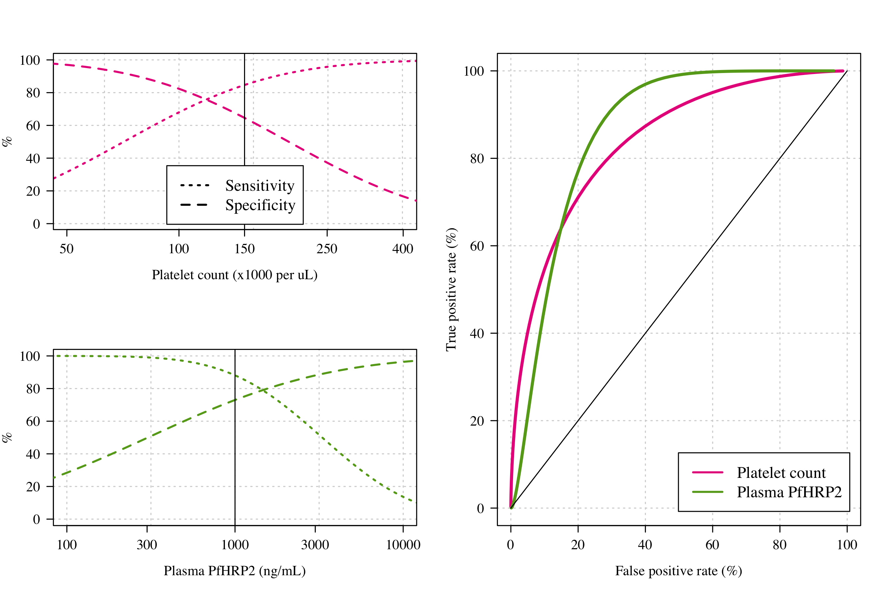

# Diagnosing severe malaria using platelets and *Pf*HRP2
 
This repository provides replication materials for "Improving the precision of severe malaria diagnosis in African children using platelet counts and plasma *Pf*HRP2 concentrations".

All data analysis is done in the RMarkdown file *Platelet_PfHRP2_SM_model.Rmd*. The R script *functions.R* has a few useful ROC curve functions, and the stan models are in the *.stan* scripts.

## Overview of dataset

We analyse platelet count and plasma *Pf*HRP2 concentration data from 2649 severely ill patients from four studies in Bangladesh, Kenya and Uganda.
We show that both biomarkers are highly discriminatory for severe malaria. 

## Results: ROC curves for single biomarkers

The highlight result are the following ROC curves comparing platelet counts, *Pf*HRP2 and parasite densities:

## Results: Optimal combination of biomarkers

For clinical studies of severe malaria, we suggest using a cutoff of 150,000 platelets per uL and a plasma concentration of 800 ng/mL. There are multiple combinations that give the same sensitivity and specificity. We choose this combination because:

* Prioritises specificity over sensitivity (specificity is more important for clinical studies/investigations)
* Uses the standard threshold for thrombocytopenia so easy to remember

## Data and code

All data necessary for replication of results are included in this repository.
If you spot any bugs or have any questions, please drop me an email me at jwatowatson at gmail dot com

The main packages needed to run the code:

* *rstan* (run the stan models - we use to estimate the posterior distribtions)
* *mgcv* (this fits generalised additive models using splines - great package)
* *mclust* (generic mixture model estimation - used for robustness checks)
* *RColorBrewer* (for lovely colors)

